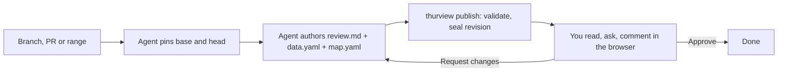

# thurview

Guided, evidence-anchored reviews of agent-written code.

A coding agent studies a branch, pull request or commit range and writes a
short document in which every claim is anchored to an exact file and line
range at a pinned commit. thurview validates the anchors, seals a revision,
and serves it in your browser: the walkthrough, live code peeks, the diff,
commits, and a software map. You ask questions, leave anchored comments, and
approve or request changes. The agent answers and republishes.

It also explains a codebase. A **code explainer** is the same document over a
different unit: one pinned commit instead of a range, so a reader can see the
architecture well enough to spot design problems themselves. It has no diff and
nothing to approve, it surfaces structure rather than grading it, and it states
what it did not examine.

It does not review the code for you. It helps you understand it fast enough
to review it yourself.


The clip is the `/thurview` skill's loop end to end: `thurview publish`, a
question arriving in `thurview wait`, the reply, then the reader following an
anchor into the code, commenting on a line range in the diff, reading the
answer in the threads panel and requesting changes.

## What the reader sees

Prose with every claim anchored to code, opened beside the text:


The diff at the pinned commits, commenting on a selected line range:


The software map: where the change landed in the system, and what sits next to
it — the question the diff cannot answer:


Threads: a question the agent already answered, and a comment held for the
decision:


Approve, or send it back with the comments:




## Install

Give your agent the skill, with the [skills](https://github.com/vercel-labs/skills)
CLI. It works with Claude Code, Codex, Cursor, OpenCode and every agent that
reads the Agent Skills format:

```sh
npx skills add Thurbeen/thurview --skill thurview
```

That form tracks this repository's default branch: `skills update` takes
whatever `main` holds, which can be ahead of the released command. To pin the
skill to a release instead, install it from the tag, which the skill lock
records and later updates keep:

```sh
npx skills add https://github.com/Thurbeen/thurview/tree/v0.1.4/skills/thurview
```

The npm package ships the same skill, so `thurview setup skill` links the copy
that matches the command you have installed. Use that when you want the two to
move together.

The skill drives the `thurview` command, which needs Node 22 or later and
git (`gh` for pull requests). Install it, or let the skill reach it through
`npx`:

```sh
npm install -g thurview     # or: pnpm add -g thurview
npx -y thurview             # no install; the skill falls back to this
```

The review reasons over a code graph thurview builds itself from the pinned
commits with tree-sitter, so nothing else needs installing. `thurview graph`
answers which interfaces the change moved, what it reaches, who calls a
symbol, what tests cover it and how files cluster, for TypeScript,
JavaScript, Python, Go, Rust and Java.

To run from a checkout instead:

```sh
pnpm install
pnpm build
npm link                    # puts `thurview` on PATH
```

Optional, for ambient context: `thurview setup hooks` installs a
SessionStart hook for Claude Code, Codex and OpenCode, so every session opens
with the reviews of its working directory. `thurview setup skill` links the
skill from this checkout instead of the `skills` CLI copy; use one or the
other.

Then, in any repository, ask your agent:

```text
Use the thurview skill to review my current branch against up-to-date main
and open it.
```

## What the reader gets

- **Interface delta**: above the document, what the change added to, changed
  in or removed from the surfaces other code can reach - exported functions
  and types, plus the CLI flags, routes, config keys and formats the agent
  declares. Derived from the code graph at both pinned commits, so a change
  that moved no surface says exactly that instead of inventing a feature.
- **Review**: the document with a table of contents. Anchor links open the
  exact code beside the text; peeks show it inline. Sequence diagrams, call
  stack diffs and storage views are clickable down to the line.
- **Files**: split or unified diff of every changed file at the pinned
  commits, with expandable context. Click a line number to comment on it.
  Click an identifier to see where it is defined at that commit; Ctrl-click
  jumps there.
- **Commits**: the commits between base and head.
- **Coverage** (explainers): every file in scope at the pinned commit, in one
  of three states - anchored in the document, placed on the map only, or not
  examined - with the parts of the system they belong to, the references that
  cross between those parts, and the names defined in more than one of them.
  Derived at publish, so what the explainer skipped is a stated fact rather
  than something the reader has to infer.
- **Map**: systems, containers, components and code, with what the change
  added, removed or touched, linked to files and code.
- **Threads**: _Send to the agent_ delivers a question at once and the answer
  lands in the same thread. _Add to the review_ holds a comment until you
  submit with _Approve_ or _Request changes_. _Close_ ends the review without
  approving it. Each thread says where it stands - held, queued, delivered or
  answered - and the panel says whether an agent is listening at all. Nothing
  claims a reader is there when none is: a question asked with no agent
  attached is queued, not lost, and reaches the agent the next time it checks.
- **Revisions**: every publish is sealed; switch back to earlier ones.
- **Theme**: the agent reads the project's design tokens and fonts and
  publishes them with the review, so each review looks like the code it
  explains. The default skin applies when the project has none.

Everything runs locally against your checkout. The server listens on
loopback and, when present, your Tailscale address, so a phone or another
machine on the tailnet can open the same URL. The layout follows: below 900px
the rail and the split diff give way to one column, the peek and the threads
panel become full-screen sheets, and the tabs and the decision stay on the
bar.

## CLI

| Command                                                               | Purpose                                                          |
| --------------------------------------------------------------------- | ---------------------------------------------------------------- |
| `thurview scaffold [--pr N \| --base R --head R]`                     | Create a review pinned to exact commits (`--update` re-pins)     |
| `thurview explain [<path>] [--commit R]`                              | Create a code explainer of a codebase or subsystem at one commit |
| `thurview info [--all]`                                               | Reviews bound to this worktree                                   |
| `thurview publish --review ID [--view T] [--open]`                    | Validate the document and map, seal a revision                   |
| `thurview open --review ID [--view T]`                                | Start the server if needed and open the browser                  |
| `thurview wait --review ID [--timeout S]`                             | Block until the reader needs the agent                           |
| `thurview threads list\|get\|reply\|resolve`                          | Read and answer threads                                          |
| `thurview graph interfaces\|impact\|callers\|tests-for\|architecture` | Ask the code graph at the pinned commits                         |
| `thurview serve` / `thurview stop`                                    | Run the server in the foreground / stop the background one       |
| `thurview setup hooks\|skill\|status`                                 | Session hooks, agent skill, install state                        |
| `thurview update`                                                     | Self-update from npm                                             |

thurview is an [AXI](https://axi.md): built for agents that drive it through a
shell. Output is [TOON](https://toonformat.dev) on stdout, errors are
structured on stdout with an actionable `help`, exit code 2 marks a usage error
(an unknown flag fails loudly and lists the valid ones), lists carry counts and
definitive empty states, long bodies are truncated with a `--full` escape
hatch, every result ends with `help[]` next steps, and `thurview` with no
arguments shows live state for the current directory instead of a manual.
`thurview <command> --help` is the fallback. Progress and diagnostics go to
stderr.

## Authoring format

The agent writes three files in `~/.thurview/reviews/<id>/`:

- `review.md`: Markdown. `[text](anchor:id)` links prose to code. Fenced
  blocks `peek`, `sequence`, `callstack` and `database` add components.
  `## Heading {collapsed}` folds a section by default.
- `data.yaml`: typed inputs: `actors`, `anchors` (file, from, to, graph),
  `stores`, `interfaces` (a capability line per derived entry, plus the
  interfaces the graph cannot see).
- `map.yaml`: the software map at head, optionally at base. In an explainer it
  carries the breadth the prose has no room for, and a node's `files` globs are
  what let a file count as placed rather than not examined.
- `theme.yaml`: the look, derived from the reviewed project's own design
  system (tokens, fonts, shape, code palette). Empty means the default skin.

An explainer writes the same files, minus `interfaces`: there is no change to
derive a delta from, and `graph: base` on an anchor is an error because there
is one commit.

`thurview publish` rejects an anchor whose file or lines do not exist at the
pinned commit, a call stack frame that claims an added or removed call the
diff does not show, a storage operation on an unknown field, a map edge
to an unknown node, an interface annotation for a symbol the change did not
move, a declared interface whose anchor holds no added or deleted line, and an
explainer that anchors nothing at all. The full format is in
[skills/thurview/references](skills/thurview/references).

Optional guidance for the agent: `~/.thurview/THURVIEW.md` for you,
`THURVIEW.md` at a repository root for that repository.

## Development

```sh
pnpm check     # type-check server and UI, run the end-to-end tests
pnpm build
pnpm dev -- scaffold
node scripts/browser-check.mjs <url> [seconds] [shot.png]   # console errors + screenshot of a view
scripts/demo/record.sh                                       # re-record media/thurview-demo.{mp4,gif}
```

Set `THURVIEW_HOME` to keep state elsewhere than `~/.thurview`.

## License

MIT
