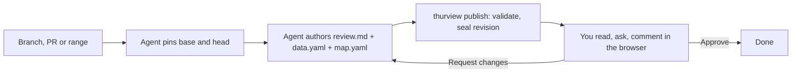

# thurview

**Your coding agent writes the review; you read it in the browser, anchored to
the code, and approve it or send it back.**

[](https://github.com/Thurbeen/thurview/actions/workflows/ci.yml)
[](https://www.npmjs.com/package/thurview)
[](https://opensource.org/licenses/MIT)


_The reader's half of it; the agent is working off camera._

- **Every claim is anchored to code.** The prose links to an exact file and
  line range at a pinned commit, and the reader opens that code beside the
  text — no hunting for what a sentence is about.
- **You read it in your browser, not in a comment thread.** An argument in the
  order somebody chose to make it, with the code, the diff between the pinned
  commits and the system around it one click away — instead of forty remarks
  in the order they happened to be written.
- **You ask, and the agent answers in the document.** A question goes to the
  agent — at once if one is listening, queued if not — and the answer lands
  in the same thread; a comment waits for your decision. Then you approve the
  change or send it back with the comments attached.
- **A code graph answers what the diff cannot.** Who calls the symbol that
  moved, which tests reach it, where the change landed in the system and what
  sits next to it. thurview builds the graph itself with tree-sitter from the
  pinned commits, for TypeScript, JavaScript, Python, Go, Rust, Java and Elixir.
- **The evidence is checked, not taken on trust.** An anchor whose lines
  do not exist at the pinned commit, a call stack frame asserting a call the
  diff does not show, an interface annotation for a symbol the change never
  moved, a trust boundary crossing that resolves to nothing — publishing
  rejects each one rather than rendering it.

## Install

One command gives your agent every skill this repository ships, through the
[skills](https://github.com/vercel-labs/skills) CLI - it works with Claude
Code, Codex, Cursor, OpenCode and every agent that reads the Agent Skills
format:

```sh
npx skills@latest add https://github.com/Thurbeen/thurview \
  --skill '*' --agent universal claude-code --global --yes
```

`--skill '*'` takes all four; quote the star so your shell does not expand it
against the current directory. The skills reach the `thurview` command through
`npx`, so the requirements are Node 22 or later and git (`gh` for pull
requests, `glab` for merge requests). Then, in any repository, ask your agent:

```text
Use the thurview skill to review my current branch against up-to-date main
and open it.
```

## The four skills

Three kinds of document, and one companion that writes none:

- **`thurview`** - a change that is already written: a branch, a pull request,
  a commit range. The document carries the diff, the commits and the interface
  delta, and the reader approves it or sends it back.
- **`thurview-explain`** - a codebase, or one subsystem of it, at a single
  pinned commit. No diff and nothing to approve: it surfaces the architecture
  well enough for the reader to spot design problems, and states what it did
  not examine.
- **`thurview-design`** - a change that is not written yet: a design, an
  architecture proposal, an implementation plan. It anchors on the code as it
  stands and declares what it would build as proposals, each attached to the
  code it lands in today.
- **`thurview-fix`** - no browser and no reader. It reviews, fixes what it is
  sure of behind the repository's own tests and lint, and reports the rest -
  optionally as inline comments on the change request.

<details>
<summary><b>Other ways to install</b> - one skill at a time, pin to a release,
install the command from npm, run from a checkout, session hooks, and coming
from an older install</summary>

`--global` installs for your user, so one install covers every repository.
`universal` puts the one real copy of each skill under `~/.agents/skills/`,
the directory no single agent owns, and every other agent you name gets a
symlink to it - `~/.claude/skills/thurview` →
`../../.agents/skills/thurview`, and the same for the other three - so an
update lands everywhere at once. Swap `claude-code` for any agent the skills
CLI supports, but keep `universal` and at least one more: with `--yes` and a
single target, the CLI copies instead of linking.

`--skill` also takes names, one or several, when you do not want all four:
`--skill thurview`, or `--skill thurview thurview-fix`.

The untagged URL above tracks this repository's default branch:
`skills update` takes whatever `main` holds, which can be ahead of the
released command. To pin the skills to a release instead, install from the
tag, which the skill lock records and later updates keep:

```sh
npx skills@latest add https://github.com/Thurbeen/thurview/tree/v0.15.0 \
  --skill '*' --agent universal claude-code --global --yes
```

Releases tag without committing, so nothing moves the tag above: swap in the
[latest release](https://github.com/Thurbeen/thurview/releases/latest).

The npm package ships the same skills, so `thurview setup skill` links the
copies that match the command you have installed. Use that when you want the
two to move together.

Install the command itself, rather than leaving the skills to reach it through
`npx` on every run:

```sh
npm install -g thurview     # or: pnpm add -g thurview
```

Nothing else needs installing: the code graph is built from the pinned commits
with tree-sitter. `thurview graph` answers which interfaces the change moved,
what it reaches, who calls a symbol, what tests cover it and how files cluster.

To run from a checkout instead:

```sh
pnpm install
pnpm build
npm link                    # puts `thurview` on PATH
```

Optional, for ambient context: `thurview setup hooks` installs a
SessionStart hook for Claude Code, Codex and OpenCode, so every session opens
with the reviews of its working directory. `thurview setup skill` links the
skills from this checkout instead of the `skills` CLI copies; use one or the
other.

**Coming from an older install.** A skill name is an address, so nothing
renames or splits one in place - the command above adds what is missing, and
what is stale has to go.

`thurview-explain` used to be a second kind inside the `thurview` skill, so an
install made before the split does not have it. Under the `skills` CLI,
updating `thurview` adds no second skill; run the install command above, which
takes all four. Under `thurview setup skill`, update the command first -
`thurview update`, or pull and rebuild the checkout you linked from - and run
`thurview setup skill` again: it links every skill the installed command
carries, so it picks the new one up on its own.

`thurview-fix` was called `review-fix`, and an install made before the rename
keeps answering to `/review-fix` from a copy that will never change again.
Remove it:

```sh
npx skills@latest remove --global review-fix
```

For a `thurview setup skill` install, delete the stale link -
`~/.agents/skills/review-fix` and the same path under `~/.claude` and
`~/.cursor` - and run `thurview setup skill` again.

</details>

## How it works

thurview validates every anchor against the pinned commits, seals a revision,
and serves it in your browser: the walkthrough, live code peeks, the diff,
commits, and a software map. You ask questions, leave anchored comments, and
approve or request changes. The agent answers and republishes.

An explainer and a design run the same loop over a different unit. An
explainer pins one commit instead of a range, so it has no diff and nothing to
approve. A design pins the commit it argues from: its anchors land on the code
as it stands, never on code that does not exist yet, and what it would build
rides beside them as proposals.

The document does not review the code for you. It helps you understand the
code fast enough to judge it yourself.



## What the reader sees

Prose with every claim anchored to code, opened beside the text:


The diff at the pinned commits, commenting on a selected line range:


The software map: where the change landed in the system, and what sits next to
it — the question the diff cannot answer:


Threads: a question the agent already answered, and a comment held for the
decision:


Approve, or send it back with the comments:


## What's in a review

- **Interface delta**: above the document, what the change added to, changed
  in or removed from the surfaces other code can reach - exported functions
  and types, plus the CLI flags, routes, config keys and formats the agent
  declares. Derived from the code graph at both pinned commits, so a change
  that moved no surface says exactly that instead of inventing a feature.
- **Review**: the document with a table of contents. Anchor links open the
  exact code beside the text; peeks show it inline. Sequence diagrams, call
  stack diffs and storage views are clickable down to the line.
- **Files**: split or unified diff of every changed file at the pinned
  commits, with expandable context. Click a line number to comment on it.
  Click an identifier to see where it is defined at that commit; Ctrl-click
  jumps there.
- **Commits**: the commits between base and head.
- **Coverage** (explainers): every file in scope at the pinned commit, in one
  of three states - anchored in the document, placed on the map only, or not
  examined - with the parts of the system they belong to, the references that
  cross between those parts, and the names defined in more than one of them.
  Derived at publish, so what the explainer skipped is a stated fact rather
  than something the reader has to infer.
- **Map**: systems, containers, components and code, with what the change
  added, removed or touched, linked to files and code.
- **Threads**: _Send to the agent_ delivers a question at once and the answer
  lands in the same thread. _Add to the review_ holds a comment until you
  submit with _Approve_ or _Request changes_. _Close_ ends the review without
  approving it. Each thread says where it stands - held, queued, delivered or
  answered - and the panel says whether an agent is listening at all. Nothing
  claims a reader is there when none is: a question asked with no agent
  attached is queued, not lost, and reaches the agent the next time it checks.
- **Revisions**: every publish is sealed; switch back to earlier ones.
- **Theme**: the agent reads the project's design tokens and fonts and
  publishes them with the review, so each review looks like the code it
  explains. The default skin applies when the project has none.

Everything runs locally against your checkout. The server listens on
loopback and, when present, your Tailscale address, so a phone or another
machine on the tailnet can open the same URL. The layout follows: below 900px
the rail and the split diff give way to one column, the peek and the threads
panel become full-screen sheets, and the tabs and the decision stay on the
bar.

## CLI

| Command                                                               | Purpose                                                               |
| --------------------------------------------------------------------- | --------------------------------------------------------------------- |
| `thurview scaffold [--pr N \| --base R --head R]`                     | Create a review pinned to exact commits (`--update` re-pins)          |
| `thurview explain [<path>] [--commit R]`                              | Create a code explainer of a codebase or subsystem at one commit      |
| `thurview design [<path>] [--commit R]`                               | Create a design of what to build, pinned to the commit it argues from |
| `thurview info [--all]`                                               | Reviews, explainers and designs bound to this worktree                |
| `thurview publish --review ID [--view T] [--open]`                    | Validate the document and map, seal a revision                        |
| `thurview open --review ID [--view T]`                                | Start the server if needed and open the browser                       |
| `thurview wait --review ID [--timeout S]`                             | Block until the reader needs the agent                                |
| `thurview threads list\|get\|reply\|resolve`                          | Read and answer threads                                               |
| `thurview graph interfaces\|impact\|callers\|tests-for\|architecture` | Ask the code graph at a review's pins, or at `--base`/`--head`        |
| `thurview forge status\|prior\|pass\|submit\|reply`                   | Read a change request through its forge, and post the review back     |
| `thurview serve` / `thurview stop`                                    | Run the server in the foreground / stop the background one            |
| `thurview setup hooks\|skill\|status`                                 | Session hooks, agent skill, install state                             |
| `thurview update`                                                     | Self-update from npm                                                  |

thurview is an [AXI](https://axi.md): built for agents that drive it through a
shell. Output is [TOON](https://toonformat.dev) on stdout, errors are
structured on stdout with an actionable `help`, exit code 2 marks a usage error
(an unknown flag fails loudly and lists the valid ones), lists carry counts and
definitive empty states, long bodies are truncated with a `--full` escape
hatch, every result ends with `help[]` next steps, and `thurview` with no
arguments shows live state for the current directory instead of a manual.
`thurview <command> --help` is the fallback. Progress and diagnostics go to
stderr.

## Review and fix

The `thurview-fix` skill reviews a branch, a commit range or a pull or merge
request, fixes what it is sure of and reports the rest, with no browser and no
approval step. For each changed symbol it asks the code graph who calls it and
which tests reach it, so a finding can name a caller the diff never shows.
Fixes that pass the repository's own tests and lint land as one local commit;
nothing is pushed unless you ask.

```sh
thurview graph impact --head HEAD                 # changed symbols, the callers they left alone, the tests
thurview graph callers discount --head HEAD       # every call site of one symbol
```

`--base` and `--head` ask about two commits directly; `--head` alone diffs
from where it forked from trunk. Each caller in `impact.reach` carries the line
of its call and whether any test reaches it.

With `--post`, the skill posts the findings it did not fix as inline comments
on the change request, through `thurview forge`:

```sh
thurview forge status --change 123    # what CI actually did, and whether it is a gate at all
thurview forge prior  --change 123    # the previous pass, thread by thread
thurview forge pass   --review <id>   # the reader's submitted threads, as the file below takes
thurview forge submit --change 123 --file pass.json --dry-run
thurview forge reply <threadId> --change 123 --body "<answer>" --resolve --at <head>
```

`status` counts passed, failed, cancelled, skipped and running checks
separately, and compares them against what the target branch's own tip runs -
a change request from a fork typically runs a fraction of them, and a
cancelled job shows no failure while asserting nothing. `ci.trustworthy` is
the only field that means the tests really passed.

`pass` goes the other way, from a review a reader submitted in the browser to
that same file: one inline comment per thread anchored to a line, questions and
resolved threads left out, and threads with no line - a document block, a map
node, a whole file - gathered into the summary and named in the output, so
nobody assumes their comment was posted where they wrote it. The verdict comes
from the reader's decision, `close` becomes a `comment`, and an approve with
threads still open is refused rather than quietly downgraded.

`submit` takes one JSON file so a human can read the pass before it is posted,
refuses an `approve` without `--confirm`, and warns about comments too long to
be read. `reply --resolve` takes `--at <sha>` and refuses any commit but the
current head, so a thread is never closed against code nobody looked at. There
is no merge, close or push command, deliberately.

GitHub goes through `gh`, GitLab through `glab`; hosts other than github.com
and gitlab.com are matched against what those CLIs are authenticated for, and
an unmatched host is refused rather than guessed. The differences that survive
the seam - GitLab has no changes-requested state, no atomic review and no
multi-line comment anchor - are listed in
[skills/thurview-fix/references/forges.md](skills/thurview-fix/references/forges.md).

## Authoring format

The agent writes three files in `~/.thurview/reviews/<id>/`:

- `review.md`: Markdown. `[text](anchor:id)` links prose to code. Fenced
  blocks `peek`, `sequence`, `callstack` and `database` add components.
  `## Heading {collapsed}` folds a section by default.
- `data.yaml`: typed inputs: `actors`, `anchors` (file, from, to, graph),
  `stores`, `interfaces` (a capability line per derived entry, plus the
  interfaces the graph cannot see), and `security`, where a review says where
  the change lets input cross a trust boundary.
- `map.yaml`: the software map at head, optionally at base. In an explainer it
  carries the breadth the prose has no room for, and a node's `files` globs are
  what let a file count as placed rather than not examined.
- `theme.yaml`: the look, derived from the reviewed project's own design
  system (tokens, fonts, shape, code palette). Empty means the default skin.

`security` is a review's own dimension, shown to the reader under the interface
delta rather than left to a section the agent might not write. It is
`security: none` when the change crosses no trust boundary, or one entry per
place it does — a sentence and the head anchor the reader opens. Left out, it
publishes as "not assessed", so a review that has not looked and one that looked
and found nothing are never the same page. What counts as a trust boundary is
defined in one place — the `thurview-fix` skill's finding rules — and
nothing else restates it.

An explainer writes the same files, minus `interfaces` and `security`: there is
no change to derive a delta from or to carry input across a boundary, and
`graph: base` on an anchor is an error because there is one commit.

A design writes the same files, and `interfaces` means something else in it:
each entry is a **proposal** — what the design would add, change or remove,
with the anchor of the code that proposal lands in, replaces or plugs into
today. `graph: base` and `security` are errors for the same reason as in an
explainer, a `symbol:` entry is an error because no diff derived one, and a
design that proposes nothing is refused: that document is an explainer. In its
`map.yaml`, `base` is the structure as it stands and `nodes` the structure it
proposes, so a proposed part may own files that do not exist yet while a `base`
node may not.

`thurview publish` rejects an anchor whose file or lines do not exist at the
pinned commit, a call stack frame that claims an added or removed call the
diff does not show, a storage operation on an unknown field, a map edge
to an unknown node, an interface annotation for a symbol the change did not
move, a declared interface whose anchor holds no added or deleted line, a trust
boundary crossing whose anchor resolves to nothing or reads the base commit, and
an explainer that anchors nothing at all, and a design that proposes nothing or
whose proposal names no site in the code as it stands. The full format is in
[skills/thurview/references](skills/thurview/references).

Optional guidance for the agent: `~/.thurview/THURVIEW.md` for you,
`THURVIEW.md` at a repository root for that repository.

## Development

```sh
pnpm check     # type-check server and UI, run the end-to-end tests
pnpm build
pnpm dev -- scaffold
node scripts/browser-check.mjs <url> [seconds] [shot.png]   # console errors + screenshot of a view
scripts/demo/record.sh                                       # re-record media/thurview-demo.{mp4,gif}
```

Set `THURVIEW_HOME` to keep state elsewhere than `~/.thurview`.

## License

MIT
