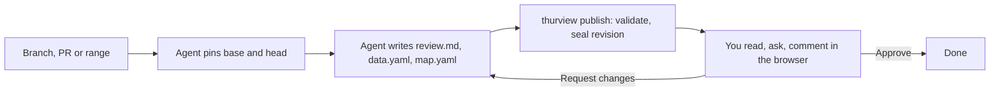

# thurview

**Your coding agent writes the review; you read it in the browser, anchored to
the code, and approve it or send it back.**

Every claim links to an exact file and line range at a pinned commit, and
`publish` refuses evidence that does not hold there. You ask in the document,
the agent answers in the same thread, and callers and tests the diff cannot
show are found by `git grep` searches you can run again.

[](https://github.com/Thurbeen/thurview/actions/workflows/ci.yml)
[](https://www.npmjs.com/package/thurview)
[](https://opensource.org/licenses/MIT)


## Install

Every skill, for any agent that reads the Agent Skills format, through the
[skills](https://github.com/vercel-labs/skills) CLI:

```sh
npx skills@latest add https://github.com/Thurbeen/thurview \
  --skill '*' --agent universal claude-code --global --yes
```

You need Node 22 or later and git, plus `gh` for pull requests or `glab` for
merge requests. Pinning a release, installing the command from npm, session
hooks and upgrading an older install are in [docs/INSTALL.md](docs/INSTALL.md).

## Quick start

In any repository, ask your agent:

```text
Use the thurview skill to review my current branch against up-to-date main
and open it.
```

For an opened PR or MR, ask `Use thurview-pr-review to review <URL>`: it
checks the cloud setup, authors and publishes the review, and keeps one linked
summary on the change request up to date on every push.


```mermaid
flowchart LR
  A[Branch, PR or range] --> B[Agent pins base and head]
  B --> C[Agent writes review.md, data.yaml, map.yaml]
  C --> D[thurview publish: validate, seal revision]
  D --> E[You read, ask, comment in the browser]
  E -->|Request changes| C
  E -->|Approve| F[Done]
```

What the reader gets (the walkthrough, the diff, the map, threads, the
decision, and the queue on the home page) is in [docs/READER.md](docs/READER.md).

## Skills

| Skill                                                      | For                                                                                                         |
| ---------------------------------------------------------- | ----------------------------------------------------------------------------------------------------------- |
| [`thurview`](skills/thurview/SKILL.md)                     | A local change already written: a branch or commit range. Approve or send back.                             |
| [`thurview-explain`](skills/thurview-explain/SKILL.md)     | A codebase or subsystem at one commit, with what it did not examine.                                        |
| [`thurview-design`](skills/thurview-design/SKILL.md)       | A change not written yet, its proposals anchored to the code they land in.                                  |
| [`thurview-fix`](skills/thurview-fix/SKILL.md)             | Review, commit the fixes that pass your tests and lint, report the rest. No browser.                        |
| [`thurview-pr-review`](skills/thurview-pr-review/SKILL.md) | An opened PR or MR: a review page, a public snapshot and one summary on the forge, followed until merge.    |
| [`thurview-publish`](skills/thurview-publish/SKILL.md)     | Put a document in your own Azure, S3, Cloud Storage or Cloudflare Pages account behind a link that expires. |

## CLI

| Command                                                     | Purpose                                                                             |
| ----------------------------------------------------------- | ----------------------------------------------------------------------------------- |
| `thurview scaffold [--pr N \| --base R --head R]`           | Create a review pinned to exact commits (`--update` re-pins)                        |
| `thurview explain [<path>] [--commit R]`                    | Create an explainer of a codebase or subsystem at one commit                        |
| `thurview design [<path>] [--commit R]`                     | Create a design, pinned to the commit it argues from                                |
| `thurview info [--all]`                                     | Documents bound to this worktree                                                    |
| `thurview publish [--review ID] [--view T] [--open]`        | Validate the document and map, seal a revision                                      |
| `thurview open [--review ID] [--view T]`                    | Start the server if needed and open the browser                                     |
| `thurview wait [--review ID] [--timeout S]`                 | Block until the reader needs the agent                                              |
| `thurview threads list\|get\|reply\|resolve`                | Read and answer threads                                                             |
| `thurview export [<id>] --out PATH [--format md]`           | Write the published revision as one HTML file, or the reader's feedback as Markdown |
| `thurview publish-static --check --to cloudflare`           | Check the Cloudflare target, login and project, uploading nothing                   |
| `thurview publish-static <id> --out DIR \| --to cloudflare` | Render a read-only snapshot, or deploy it to Cloudflare                             |
| `thurview forge status\|prior\|pass\|submit\|reply`         | Read a change request, and post a review back to it                                 |
| `thurview pr-review status\|sync\|wait\|stop\|start`        | Follow a change request until it merges                                             |
| `thurview delete --review ID`                               | Delete a document and what is stored for it                                         |
| `thurview serve` / `thurview stop`                          | Run the server in the foreground / stop the background one                          |
| `thurview setup hooks\|skill\|status`                       | Session hooks, agent skills, install state                                          |
| `thurview update`                                           | Self-update from npm                                                                |

thurview is an [AXI](https://axi.md): output is [TOON](https://toonformat.dev),
errors carry a `help` to act on, and `thurview` with no arguments shows the
current directory's state. `thurview <command> --help` lists every flag.

## Configuration

Everything lives under `~/.thurview` (or `$THURVIEW_HOME`) and runs against
your checkout; the server listens on loopback and your Tailscale address.

- **Agent guidance**: `~/.thurview/THURVIEW.md` for you, `THURVIEW.md` at a
  repository root for that repository.
- **Cloudflare snapshots**: `~/.thurview/cloudflare.json`; see
  [setup](skills/thurview-pr-review/references/cloudflare-setup.md) and
  [public static snapshots](skills/thurview/references/lifecycle.md#public-static-snapshots).
- **Your own cloud**: credentials, permissions and link expiry per provider are in
  [thurview-publish](skills/thurview-publish/SKILL.md).

## Documentation

- [docs/READER.md](docs/READER.md): every tab, threads, the decision, sharing.
- [Markdown export](skills/thurview/references/agent-export.md): the feedback handoff to an agent.
- [docs/INSTALL.md](docs/INSTALL.md): other install routes and upgrades.
- The document format: [authoring](skills/thurview/references/document-authoring.md),
  [components](skills/thurview/references/components.md),
  [software map](skills/thurview/references/software-map.md),
  [lifecycle](skills/thurview/references/lifecycle.md).
- Forges: [commands and differences](skills/thurview-fix/references/forges.md).

## Contributing

[CONTRIBUTING.md](CONTRIBUTING.md) covers the hooks, the gate, commits and releases.

```sh
pnpm install && pnpm build && pnpm check
```

## License

MIT, see [LICENSE](LICENSE).
