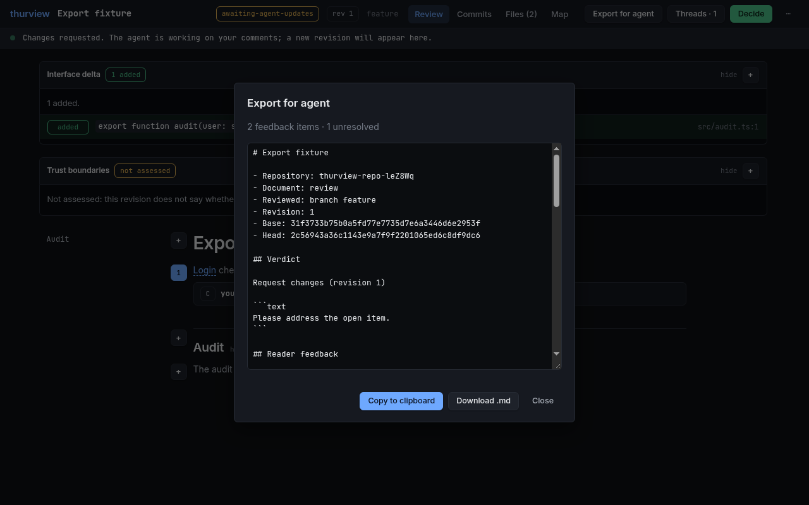

# What the reader sees

The document does not review the code for you. It helps you understand the
code fast enough to judge it yourself.

A review pins a base and a head. An explainer pins one commit, so it has no
diff and nothing to approve. A design pins the commit it argues from: its
anchors land on the code as it stands, and what it would build rides beside
them as proposals.

## The home page

The home page is a queue: every review, explainer and design, grouped by
repository and ordered by whose turn it is - a decision not yet posted to its
change request first, then documents waiting for your reading, then ones whose
change request moved past the pin, then ones waiting for the agent, then ones
not published yet. A row bound to a change request also says whether the pin is
still the head, what you decided and whether it reached the forge, and whether
CI is a real gate there, as of the last `forge` command and with that age on
screen. The browser never calls the forge; explainers and designs carry those
columns empty.

## The tabs

- **Interface delta**: above the document, what the change added to, changed
  in or removed from the surfaces other code can reach - exported functions
  and types, CLI flags, routes, config keys and formats. The agent declares
  each one, and publish holds it to an anchor on lines the diff really moved,
  so an entry cannot invent a feature the change did not deliver. Under it, the
  security entry says where the change lets input cross a trust boundary, or
  "not assessed" when the agent did not look.
- **Review**: the document with a table of contents. Anchor links open the
  exact code beside the text; peeks show it inline. Sequence diagrams, call
  stack diffs and storage views are clickable down to the line.
- **Files**: split or unified diff of every changed file at the pinned
  commits, with expandable context. Click a line number to comment on it.
  Click an identifier to see where it is defined at that commit; Ctrl-click
  jumps there. Explainers and designs show full files at their pinned commit.
  A file tree sits beside Files, Commits and Coverage: compact folder chains,
  change statuses and line totals, comment and anchor markers, and a path
  filter. Use arrows to move, Left/Right to fold, Enter to open, or the expand
  and collapse all buttons. Drag the divider to resize it; the width and folds
  are remembered. On a narrow screen, use Files to open the drawer.
- **Commits**: the commits between base and head.
- **Coverage** (explainers): every file in scope at the pinned commit, in one
  of four states - anchored in the document, placed on the map only, matched
  by a search the agent recorded, or not examined - grouped by directory, with
  each search and what it matched. Derived at publish, which re-runs every
  recorded search with `git grep` at the pinned commit, so what the explainer
  skipped is a stated fact rather than something the reader has to infer.
- **Map**: systems, containers, components and code, with what the change
  added, removed or touched, linked to files and code - where the change landed
  in the system, and what sits next to it.
- **Revisions**: every publish is sealed; switch back to earlier ones.
- **Theme**: light or dark, following the system until you pick one in the ⋯ menu.

Prose with every claim anchored to code, opened beside the text:

The diff at the pinned commits, commenting on a selected line range:

The software map: where the change landed, and what sits next to it:

## Threads and the decision

_Send to the agent_ delivers a question at once and the answer lands in the
same thread. _Add to the review_ holds a comment until you submit with
_Approve_ or _Request changes_. _Close the review_ ends it without approving
it; a design says _Drop the design_ and an explainer _Stop reading_.
Each thread says where it stands - held, queued, delivered or answered - and
the panel says whether an agent is listening at all. Nothing claims a reader is
there when none is: a question asked with no agent attached is queued, not
lost, and reaches the agent the next time it checks.

## On another device

Everything runs locally against your checkout. The server listens on loopback
and, when present, your Tailscale address, so a phone or another machine on the
tailnet can open the same URL. The layout follows: below 900px the rail and the
split diff give way to one column, the peek and the threads panel become
full-screen sheets, and the tabs and the decision stay on the bar.

## Handing feedback to an agent

The reader's **Export for agent** action produces one portable Markdown
handoff: pins, verdicts, anchored feedback, answers and an unresolved checklist.
Copy it or download it as `.md`; agents can fetch the same document with
`thurview export <id> --format md --out feedback.md`. The full contract is in
[Markdown export](../skills/thurview/references/agent-export.md).

## Sharing with someone who does not run thurview

`thurview export --out review.html` writes the published revision as one HTML
file: the same page, read only, with every snippet, diagram and diff resolved
at the pinned commits and the reader's threads shown as notes (`--no-threads`
leaves them out). It opens from disk, fetches nothing, and names no server and
no local path. Point `--out` at a folder for `<folder>/index.html`, such as a
repository's Pages folder.

Whoever opens a copy can still comment: the `+` beside a paragraph, a line
number or a selection adds a note that stays in their browser.
_Export for agent_ then gives the Markdown of what was sent with their notes
added, to hand to an agent. Nothing they write reaches the review or its
agent unless they send that Markdown.

For a link instead of a file, `thurview publish-static` deploys a durable
read-only snapshot to Cloudflare (see
[public static snapshots](../skills/thurview/references/lifecycle.md#public-static-snapshots)),
and the [thurview-publish](../skills/thurview-publish/SKILL.md) skill puts a
document in your own cloud account behind a link that expires.
