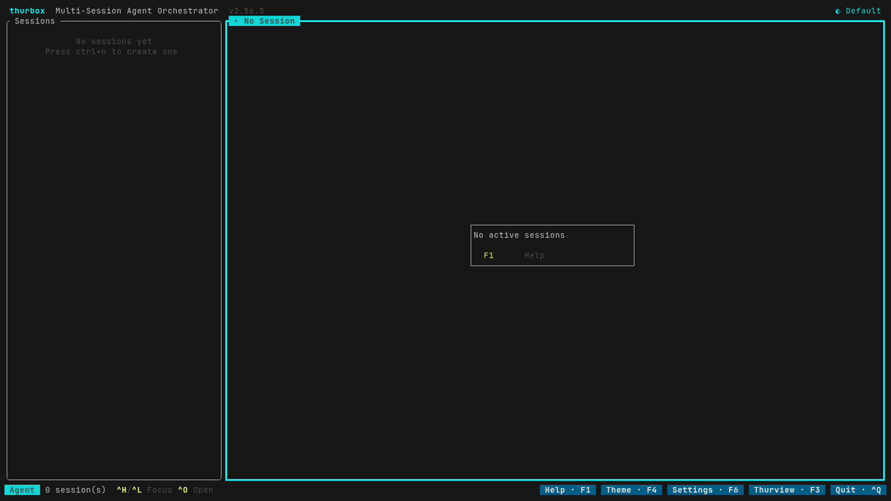
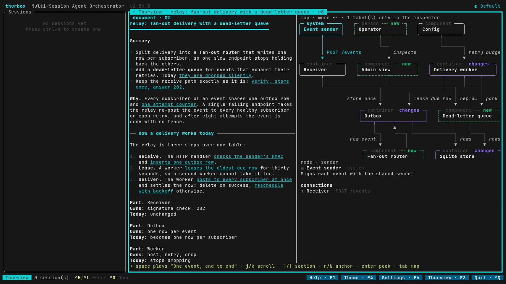
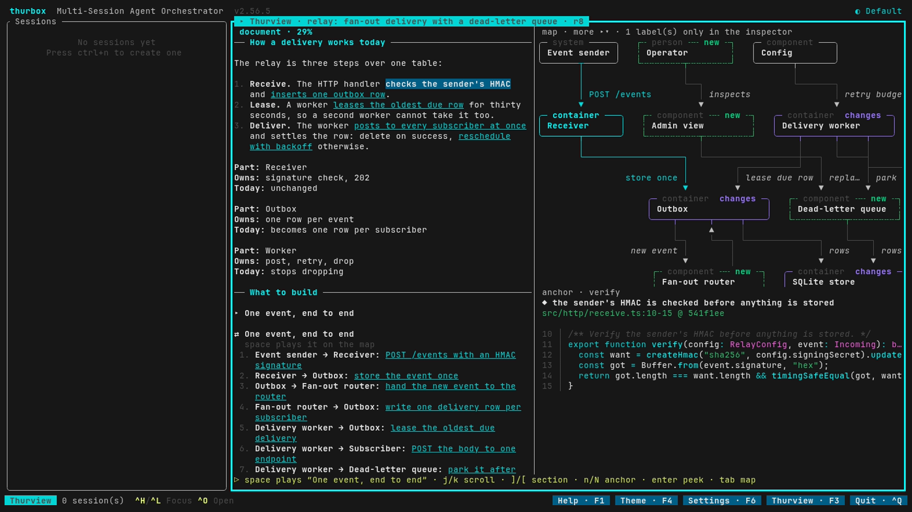
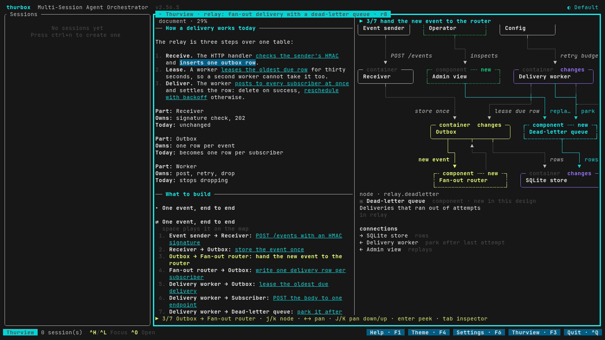
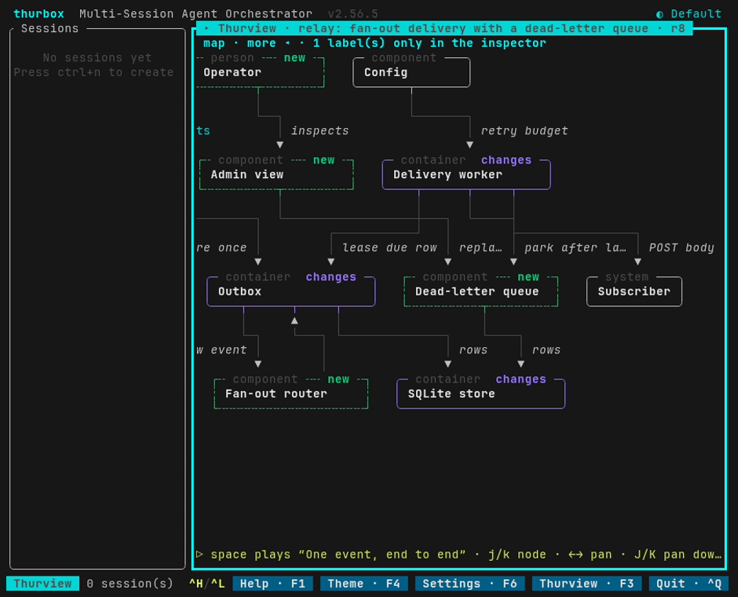

# Thurview in a terminal: proof of concept

A thurview architecture document drawn inside a terminal by a thurbox pane: the
prose, the software map as a diagram of boxes and labelled connections, code
anchors at the pinned commit, keyboard navigation and a flow animation. All of it
uses text and box-drawing characters, with no browser or WebView anywhere.

This is a proof of concept, not an integration. It reads one published revision
and draws it. It does not comment, answer threads, decide, edit or sync, and
nothing here is installed by thurview.



| Wide pane: document, map, inspector          | An anchor's code at the pinned commit       |
| -------------------------------------------- | ------------------------------------------- |
|  |            |
| **A sequence playing over the map**          | **Narrow pane: the map on its own, panned** |
|            |    |

Every image is a capture of the real thurbox 2.56.5 TUI recorded with VHS
(`demo.tape`, `narrow.tape`), not a mock-up.

## Try it

From a checkout of this repository, with `pnpm install` done and `git`, `tmux`,
`thurbox` and `thurbox-cli` on `PATH`:

```sh
examples/terminal-poc/demo.sh          # build, install into a sandbox, launch
examples/terminal-poc/demo.sh clean    # stop the sandbox and delete it
```

`demo.sh` never touches your own thurbox. It runs one under
`~/.cache/tvpoc` with its own `HOME`, `THURBOX_CONFIG_DIR`,
`THURBOX_DATA_DIR`, session socket and `TMUX_TMPDIR`. It commits the fixture's
code to a scratch repository and publishes the fixture design there with
thurview itself, into a `THURVIEW_HOME` of its own. It then projects the sealed
revision, installs the pane and starts that thurbox.

To view one of your own published documents instead, point it at a revision
directory. The revision is only read:

```sh
THURVIEW_POC_REVISION=~/.thurview/reviews/<id>/revisions/<n> examples/terminal-poc/demo.sh
```

In the sandbox:

| Key                           | Where    | Does                                                         |
| ----------------------------- | -------- | ------------------------------------------------------------ |
| `F3`                          | anywhere | open the pane, or go back where you were                     |
| `Tab`                         | pane     | document → map → inspector (one at a time below 100 columns) |
| `j` `k` `PgDn` `PgUp` `g` `G` | document | scroll                                                       |
| `]` `[`                       | document | next / previous section                                      |
| `n` `N`                       | document | next / previous code anchor; the map follows it              |
| `Enter`                       | document | read the anchor's code in the inspector                      |
| `j` `k`                       | map      | select the next / previous part                              |
| `←` `→` `J` `K`               | map      | pan                                                          |
| `Space`                       | pane     | play or pause the sequence over the map                      |
| `.` `,` `s`                   | pane     | step forward / back, next sequence                           |

`F1` lists the same keys, and `Ctrl+P` → "thurview" opens the pane too.

To install into another isolated interface directory by hand:

```sh
node node_modules/tsx/dist/cli.mjs examples/terminal-poc/project.ts <revision dir> model.lua
examples/terminal-poc/install.sh <interface dir> model.lua
thurbox-cli plugin check
```

## How it works

```text
 thurview publish            project.ts                 thurbox pane
 ────────────────            ──────────                 ────────────
 review.md ┐                 document.json ─┐           plugins/85_thurview_poc.lua
 data.yaml ├─► sealed ─────► map.json ──────┼─► model ─► thurview_poc/view.lua
 map.yaml  ┘   revision      meta.json ─────┘   .lua     thurview_poc/diagram.lua
               (the authority)   (read only)                 │
                                                             ▼
                                                rows of styled cells → theme roles
```

- **One authority.** `thurview publish` has already validated the document and
  resolved every anchor at the pinned commit. `project.ts` reads the sealed
  revision's `document.json`, `map.json` and `meta.json` and nothing else: no
  git, no compiler, no second copy of the rules, no store of its own. It turns
  the browser-shaped parts into terminal-shaped ones: HTML prose becomes styled
  runs, highlighted code spans become role tokens, and sequence actors become
  the map nodes they name.
- **The view is host-independent.** `view.lua` and `diagram.lua` read no
  thurbox global. They take a size and a clock and return rows of spans with
  semantic styles. That is why the tests run them in plain Lua 5.4, the
  interpreter thurbox embeds, and why the pane file is a thin adapter: rect,
  keys, clock and theme roles.
- **The diagram** is a layered layout, the way dot does it: cycles broken,
  longest-path layers, placeholders threaded through the layers a long edge
  skips, barycentre ordering, and edges routed through per-channel lanes so two
  runs never share a cell lengthwise. Labels go in free cells beside their
  arrowheads. A label that finds no room is counted on the map's caption and
  listed in the inspector. Proposed parts get dashed borders and `new`, changed
  ones are marked `changes`. Only leaf parts are drawn; the inspector names a
  part's parent.
- **The animation** plays one sequence block over the map, message by message:
  the edge and both parts light up, the message's line in the document lights
  up, and the map pans to keep it in view. It steps every 1.2 s, stops by itself
  after the last message, pauses on `Space`, and reads the clock only while it
  plays. A hidden pane is not rendered, so it costs nothing and resumes where it
  was.

## What carries over, and what needs a design of its own

| Carries over to a terminal                                                | Needs a design of its own                                                                               |
| ------------------------------------------------------------------------- | ------------------------------------------------------------------------------------------------------- |
| Title, sections, prose with emphasis, lists, tables (stacked when narrow) | Inline images, rich HTML, and pixel-exact diagrams                                                      |
| Code anchors: file, lines, pinned commit, highlighted code                | A file explorer and full diffs with editing                                                             |
| The software map: parts, kinds, proposal marks, labelled connections      | Nested containers drawn as boundaries, base-versus-proposal toggling, maps of 50+ parts                 |
| Sequence blocks, played over the map; flow blocks as text                 | Callstack and database components (named, "drawn in the browser only")                                  |
| Navigation by section, anchor and part; pan; narrow layouts               | Threads, comments, decisions and shared presence: they need thurview's server as the writer, not a pane |

## Feasibility, measured

Measured on Linux with thurbox 2.56.5, in a 160 × 45 terminal, against the
fixture here and against a real design with 21 parts, 21 connections and 17
sections.

- **The baseline needs nothing the host lacks.** The pane uses only the
  documented API: four node kinds, `require` inside the interface directory, the
  theme roles, declared keys, a pill and a palette command. It asks for no
  capability. `thurbox-cli plugin check` loads it, lua-language-server finds no
  problem against `thurbox.d.lua`, and selene finds none against thurbox's
  sandbox standard library.
- **Raster graphics are not available, so the baseline does without them.** A
  pane paints ratatui cells, and a program surface is emulated by the `vt100`
  crate, which has no sixel or kitty graphics support. Nothing a plugin draws
  can reach the terminal as an image. Box drawing at one cell per glyph is the
  ceiling, and the screenshots show what it buys.

**Cost.** In plain Lua 5.4, a frame at 158 × 42 takes about 1.5 ms. The first
frame takes 3 ms on the fixture and 17 ms on the larger design: wrapping the
document and laying out the map, once per width. Process CPU of the whole TUI,
sampled from `/proc` over 6–8 s windows:

| State                     | CPU of one core |
| ------------------------- | --------------- |
| Pane closed (baseline)    | 0.6%            |
| Pane open, idle           | 1.6%            |
| Flow playing              | 3.3%            |
| Flow playing, pane hidden | 0.7%            |

No subprocess runs, ever. Nothing is spawned per frame or at all.

### Host gaps, exactly

None of these blocked the proof of concept. Each is what a production plugin
would ask thurbox for.

1. **A pane cannot ask for the animation clock.** `ctx.elapsed` invalidates a
   `pure` pane only on the shared tick, and the host advances that tick only
   while a session is working, a command is in flight or a repository read is
   pending. On an idle screen a pure pane's animation freezes. So this pane is
   not `pure`. It caches its own tree while idle; the host still calls it on
   every repaint, which is the idle 1.0% over baseline above. A
   declaration such as "animating until I say otherwise" would let it be pure.
2. **No data channel without trust.** `require` loads Lua only from inside the
   interface directory, and `files.read` is rooted at a session's working tree.
   So the proof of concept installs the projected model as a Lua module beside
   the pane. A live plugin would call thurview through `run`, which the user
   must grant per file. Its answer is text, and the sandbox has neither `load`
   nor a JSON decoder, so the plugin would carry a small decoder, or thurview
   would emit a line format.
3. **Width is counted in code points.** The view assumes one column per
   character, which holds for box drawing and Latin text but not for CJK. The
   host's `text.width` is the fix, kept out so the view runs outside thurbox.

## Towards a thurbox-thurview plugin

1. **thurview projects, the plugin draws.** Move `project.ts` into the CLI as a
   command (say `thurview terminal-model --review <id>`), so the store stays the
   only authority. The plugin never parses `review.md` and never keeps a copy.
2. **A plugin repository** installed with
   `thurbox-cli plugin install git+<url>`, holding these three Lua files. With
   `run` granted it asks thurview for the model and refreshes on a short `ttl`.
   Without the grant it says so, as the shipped panes do.
3. **Writes go through thurview.** Comments, thread replies and decisions become
   `thurview threads reply` / `resolve` calls through `run`. The server and its
   store remain the one writer, and the pane shows what thurview answers.
4. **The tests come along.** `test/terminal-poc.test.ts` already drives the view
   in Lua 5.4 and the installed pane in an isolated thurbox through tmux. The
   same pair would gate the plugin.

## Files

| File                             | What it is                                                  |
| -------------------------------- | ----------------------------------------------------------- |
| `project.ts`                     | sealed revision → `model.lua`                               |
| `ui/plugins/85_thurview_poc.lua` | the thurbox adapter: keys, clock, theme, idle cache         |
| `ui/thurview_poc/view.lua`       | layout, navigation, inspector, animation                    |
| `ui/thurview_poc/diagram.lua`    | the map as a grid of cells                                  |
| `install.sh`                     | copies the pane and a model into an interface directory     |
| `demo.sh`                        | the whole sandbox: build, publish, project, install, launch |
| `demo.tape`, `narrow.tape`       | the VHS scripts that recorded `media/`                      |
| `fixture/`                       | a sanitized design: a small webhook relay and its code      |
