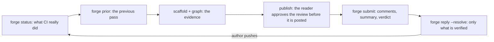

# forge-review

thurview authors the evidence; the forge is where the review lands. This skill
is the bridge between them, and it is the only one that posts.



Run the CLI as `thurview`, or `npx -y thurview` when it is not on PATH. Every
command prints TOON on stdout, errors are structured on stdout too, exit code
2 is a usage error. If a command answers `unknown command` or `unknown flag`
for something below, the installed CLI is older than this skill: run
`thurview update` and retry once.

## Request

$ARGUMENTS

A number or URL names the change request. Empty means the change request open
from the current branch - `thurview forge status` with no `--change` finds it
through the active review's binding, and when there is none, ask which one
rather than guessing.

## The word

GitHub calls it a pull request, GitLab a merge request. Everything here calls
it a **change request** and the CLI takes `--change <number|url>` on either
forge. Use the forge's own word only when you are writing to the author on
that forge.

Forge coverage, and what a third forge would need, is in
[Forges](references/forges.md). Read it when a call fails or the forge is not
github.com.

## What this never does

Never merge, never close, never push to the branch under review. You usually
cannot push to a fork at all, so **every finding is a comment**. Merging is
the maintainer's decision and the CLI has no command for it.

## Before you start

Read `~/.agent-rules/VOICE.md` **on every run**. Every comment, reply and
summary is published on the operator's account, and that file is the spec for
how they read - the sign-off line and its exact wording, the length budget per
comment, severity prefixes, and when to ask instead of assert. It changes; do
not work from memory of it, and do not copy it in here.

Two consequences of it shape everything below, so they are worth saying once:
a comment is a few lines and no more, and it ends with the sign-off as a plain
last line. A finding that will not fit is **two comments**, or one comment
carrying the claim and one suggestion with the evidence behind a permalink -
never a wall of prose on a line of someone's diff.

## Workflow

### 1. Ask the forge what it knows, before forming any opinion

```sh
thurview forge status --change <ref>
```

Record `change.head`. That commit is what this pass reviews, and a later pass
diffs against it to find what moved. Note `change.fromFork` and
`change.author`: a change request from outside the organisation is the case
every rule here was learned on.

### 2. Establish what CI actually ran

`ci.verdict` is one sentence you can quote. `ci.trustworthy` is the only field
that means "the tests really passed here".

Two failures this answers, both of which shipped real bugs:

- **A fork change request has almost no CI.** `ci.baselineRan` is what the
  target branch's own tip runs. One check here against twenty there means the
  pipeline is not a gate on this change - the review is.
- **A green tick can mean "never ran".** `passed`, `failed`, `cancelled`,
  `skipped` and `running` are counted separately because a cancelled job
  asserted nothing while showing no failure. A title-gate failure that
  cancels the test matrix leaves exactly that shape.

When `ci.trustworthy` is false, **say so in the summary comment in your own
words, with the counts**. An unstated gap is one the maintainer will assume
you checked.

### 3. Read the previous pass back, point by point

```sh
thurview forge prior --change <ref>          # add --mine for this account's threads
```

`summary.passes` of 0 means this is a first pass; skip to step 4.

Otherwise this is a **re-review, and answering the prior pass is the most
important thing you will do here**. A point raised and then silently dropped
teaches the author that review is noise.

Go through every open thread and give it exactly one of three words:

| Word                | What you do                                                     |
| ------------------- | --------------------------------------------------------------- |
| addressed           | Verify it at the current head, then reply and resolve (step 8)  |
| partially addressed | Reply saying which part is done and which is not; leave it open |
| untouched           | Reply asking for it again, or say why you are dropping it       |

`threads[].atHead` is false when the thread was written against an older
commit, and `outdated` when the code under it moved. Neither means the point
was fixed - only reading the code at the current head means that.

### 4. Diff only what moved

On a re-review, read the new work rather than the whole change again:

```sh
git range-diff <base>...<previous head> <base>...<current head>
```

The previous head is the one you recorded last pass, or `review.pinnedHead`
from `forge status`. Read the full diff only on a first pass.

### 5. Get the evidence from thurview

```sh
thurview scaffold --pr <ref>                 # pins base and head from the forge
thurview graph interfaces --review <id>      # what the change moved in the visible surface
thurview graph impact --review <id>          # what it reaches that the diff does not show
thurview graph callers <symbol> --review <id>
thurview graph tests-for <symbol> --review <id>
```

The thurview skill owns these in full - `thurview skill` prints the path to
its SKILL.md, and its references sit beside it. Read them when you author the
document in step 6; do not re-derive structure from hunks.

Read every line you are about to comment on **at the pinned head**, with
`git show <head>:<path>`, never from the working tree.

### 6. Decide who reads the review before the forge does

Default: **a human approves the pass before it is posted.** Author the
thurview document as the thurview skill describes, publish it, and wait:

```sh
thurview publish --review <id> --open
thurview wait --review <id> --timeout <seconds>
```

The reader sees every finding against its anchored code and approves or sends
it back; `wait.reason` of `accepted` is your signal to post. This is the whole
reason to go through thurview rather than straight to `gh`: comments land on
the operator's account, on a contributor's work, and are read as the
maintainer's word.

Post without that gate only when the user asked for an unattended run. Say in
the handover which of the two happened.

**Never put the thurview URL in a forge comment.** That server is local to
this machine; the author cannot open it, and the link leaks a path. Evidence
that must travel goes in a permalink - `status.permalink` shows the shape for
this forge, with the pinned head already in it.

### 7. Write the pass

One JSON file, which is also what a human can read before it is posted:

```json
{
  "verdict": "request-changes",
  "body": "<the summary, in VOICE.md's shape, ending with the sign-off>",
  "comments": [
    {
      "path": "src/clip.rs",
      "line": 44,
      "startLine": 40,
      "side": "head",
      "body": "<one point, ending with the sign-off>"
    }
  ]
}
```

`line` is the LAST line of the range and `startLine` the first. `side` is
`head` unless you are commenting on a line the change deleted. Both forges
refuse a comment on a line the diff does not touch, so anchor inside a hunk.

Per comment: one point, stated as a problem then a concrete suggestion,
within VOICE.md's length budget, sign-off last. **A finding you cannot
reproduce is a question, not an assertion** - give the mechanism and the
evidence, say what you could not reproduce, and ask the author to confirm.
That is the correct form, not a weaker one.

The summary body carries what has no line: what CI did and did not establish
(step 2), the security result (step 5 of
[Security surfaces](references/security-surfaces.md)), and who does what next.

Check it before it goes anywhere:

```sh
thurview forge submit --change <ref> --file pass.json --dry-run
```

`warnings` names every comment past the line budget. Split those, do not
shorten by deleting the suggestion.

### 8. Submit

```sh
thurview forge submit --change <ref> --file pass.json
```

`verdict` is `comment`, `request-changes` or `approve`.

**Approving is a state change with consequences, and you say them out loud
before you do it.** It dismisses a standing request for changes, which is what
makes the change request mergeable, and where auto-merge is armed it merges
the code with no further human read. The CLI refuses an approve without
`--confirm` for that reason; the flag is not a formality, it is the point at
which you have told the user.

Record `submitted.head`. That is the commit the next pass diffs against.

### 9. Resolve only what you verified

```sh
thurview forge reply <threadId> --change <ref> --body "<answer>" --resolve --at <head>
```

`--at` must be the current head, and the CLI refuses any other. Resolving a
thread tells the author a point was accepted; doing it without reading the
code at that head is worse than leaving it open. A thread deferred by
agreement may be resolved only when the agreement is written in the thread.

Reply without `--resolve` for a point that is partially addressed.

### 10. Hand over

Tell the user, in a few lines:

- the change request, its head, and the verdict you posted
- what CI established, in one clause, when `ci.trustworthy` was false
- how many comments, and how many prior threads you resolved
- whether a human approved the pass first, or it was unattended
- what you are waiting for now - the author's push, or the maintainer's merge

## Re-review after a push

Start at step 1 again. The head will have moved; `forge status` says so and
`review.pinnedHead` holds what you reviewed last. Re-pin with
`thurview scaffold --update --review <id>`, range-diff from the old head, and
answer the prior pass before reading anything new.

## Completion criteria

Report completion only when all of these hold:

- `forge status` was read and its CI verdict is reflected in the summary.
- Every prior thread is marked addressed, partially addressed or untouched.
- Security is stated explicitly, findings or none.
- The pass is posted, with a verdict, and its head is recorded.
- Every thread you resolved was verified at the current head.
- Nothing was merged, closed or pushed.
