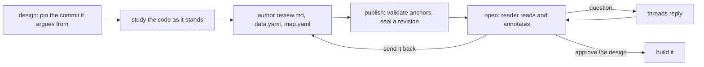

# thurview design

A **design document** says what should be built and why, argued against the
code as it stands. It is the third thurview document kind, beside a review of a
change and an explainer of a codebase, and it is read in the same browser
surface: anchored code peeks, a map, threads, revisions, and a decision that is
**Approve the design** or **Send it back**.

thurview is evidence-anchored, so the whole kind turns on one rule. Read
[Anchors and proposals](references/anchors-and-proposals.md) before you write
anything. The short version:

> **An anchor is evidence, never a proposal.** Every anchor in a design
> document resolves to real code at the one pinned commit — what the design
> changes, and what constrains it. Code the design would write is declared as a
> **proposal**, and a proposal names the **site**: the anchor of the code it
> lands in, replaces or plugs into today.

A design that lands nowhere in today's code has nothing thurview can anchor.
Say so and write ordinary prose instead; do not pin a commit to get a page.



Run the CLI as `thurview`; `npx -y thurview` runs the published package with
the same commands. Every command prints TOON on stdout — the result, then
`help[]` with the next commands. Errors are structured on stdout too (`error`,
`code`, `help`); exit 1 is a failure, 2 a usage error. If a command answers
`unknown command` for something this skill tells you to run, the installed CLI
is older than the skill: run `thurview update`, retry once, then report it.

## Request

$ARGUMENTS

A path scope narrows the design to one part of the system; with none it is the
whole repository. The rest of the request is what to design.

## Which kind is this

| The request is about                                          | Kind       | Skill                                    |
| ------------------------------------------------------------- | ---------- | ---------------------------------------- |
| code that is written — a branch, a PR, a range                | review     | `thurview`                               |
| code that exists, explained — "how does this work"            | explainer  | `thurview`, its code-explainer reference |
| code that is **not written yet** — "how should we build this" | **design** | this one                                 |

A plan for work already done is a review. An explanation with a
recommendation stapled on is an explainer that broke its own rule. If the
request is genuinely "explain this, then propose a change", write the design:
its anchors carry the explanation and its proposals carry the change.

## Before authoring

Read the guidance files that exist, in this order; the second wins on conflict.

1. `~/.thurview/THURVIEW.md` (or `$THURVIEW_HOME/THURVIEW.md`), user guidance.
2. `THURVIEW.md` at the repository root, repository guidance.

`thurview design` lists the ones it found under `guidance`.

The `thurview` skill ships the references this one shares — components,
software map, theme, lifecycle. `thurview skill` prints the path of every
bundled SKILL.md; the references sit beside each one. Read **Components**
before you edit `data.yaml`, **Software map** before you author `map.yaml`,
**Theme** before you write `theme.yaml`, and **Lifecycle** for statuses,
storage and thread rules — they are identical for all three kinds.

## Workflow

### 1. Pin the commit the design argues from

```sh
thurview design                     # the whole repository at HEAD
thurview design src/server          # one part of it
thurview design --commit v1.2.0     # a released commit rather than HEAD
```

A design is pinned to **one** commit: the code as it stands, which the design
changes. An active design on the same scope is reused and re-pinned
(`design.reused` is true); `--new` starts a separate one, and
`thurview design --update --review <id>` re-pins after the branch moves.

Record `design.id`, `design.dir`, `design.commit`, `design.scope`,
`scale.filesInScope`, `files.*` and `guidance`. Everywhere else the id is
passed as `--review <id>`; that flag names a document, whichever kind it is.

### 2. Study what the design has to fit

The design is an argument about a system, so read the system before proposing
anything. The code graph is the fastest way in, and it is the same graph the
reader can re-derive:

```sh
thurview graph architecture --review <id>       # clusters in the scope, their hubs, the edges between them
thurview graph callers <symbol> --review <id>   # who depends on what you plan to change
thurview graph tests-for <symbol> --review <id> # what would have to move with it
```

`graph interfaces` and `graph impact` compare two commits and are refused here:
there is one. The graph covers TypeScript, JavaScript, Python, Go, Rust, Java
and Elixir; other files are absent from it, not empty, and `truncated` means
the answer is partial.

Read every range you intend to anchor from the pinned commit itself —
`git show <commit>:<path>` — not from the working tree.

### 3. Decide what it proposes, and anchor each proposal to its site

This is the step the kind exists for. In `data.yaml`, under `interfaces`, write
one entry per interface the design would **add, change or remove**:

```yaml
anchors:
  dispatch:
    title: where a request picks its handler today
    peek: { file: src/server/router.ts, from: 41, to: 58 }

interfaces:
  routeTable:
    name: Router.register(path, handler)
    change: added
    capability: A feature registers its own route instead of editing the switch.
    anchor: dispatch
```

- `name` is what a consumer would type or call. `change` is what the design
  would do to it. `capability` is what it lets somebody do, in their words, not
  a restatement of the signature.
- `anchor` is the **site**: real code at the pinned commit that this proposal
  lands in, replaces or plugs into. It must resolve and it must have a `peek`.
- A `symbol:` entry is refused. That shape annotates a row the code graph
  derived from a diff, and a design has none.
- **A design with no entry here is refused.** A document that proposes nothing
  is an explainer; write one of those instead.

The panel above the document states these as `Proposed: 2 added, 1 changed.`,
in the slot a review gives the interface delta. Do not repeat the list in
prose — explain the ones whose consequence is not obvious.

### 4. Author the document

Edit `review.md` in the design directory. Keep it short; a design nobody
finishes is a design nobody decided on. A shape that works:

1. **What we are trying to do** — the problem, in the requester's terms.
2. **How it works today** — anchored. Every sentence about current behaviour
   links to the code with `[text](anchor:<id>)` or shows it with a `peek`
   fence. This is what makes a design arguable rather than assertible.
3. **What to build** — the proposals in step 3, with the reasoning the panel
   cannot carry.
4. **What it costs** — what has to move, what breaks, what is left out. Use
   `thurview graph callers` for the blast radius rather than guessing it.
5. **What was considered and dropped**, with the reason. This is the section
   readers send a design back for missing.

**Proposed code goes in a plain fenced block, never in a peek.** A peek is
code that exists at the pinned commit; a plain fence is a sketch. The reader
tells them apart at a glance, and that difference is the whole trust model.

Sequence diagrams work for a proposed flow: give a message a `code:` string
rather than an `anchor:` where the code does not exist yet, and an `anchor:`
where it does. See the `thurview` skill's Components reference for the shape.

### 5. Map the shape, when there is one

The Map tab is where a design shows structure. Put the structure it
**proposes** under `nodes`/`edges` and the structure **as it stands** under
`base`, and the reader sees exactly what the design adds, changes and removes.

- A node under `nodes` may own files that do not exist yet. That is a proposed
  part, and publish does not warn about it.
- A node under `base` may not. It is a claim about today, and publish warns
  when its globs match nothing at the pinned commit.
- Seed `base` from `thurview graph architecture --review <id>`.

A design that changes one part in place does not raise the question: leave
`nodes: []` and say so in the handover.

### 6. Theme, then publish

Write `theme.yaml` per the `thurview` skill's Theme reference, or leave it
empty for the default skin. Then:

```sh
thurview publish --review <id>
```

Read every row of `diagnostics`. Fix each `error` and publish again; a
`warning` does not block. On success, `published.proposes` is the verdict the
reader sees above the document, and `published.url` is the page.

```sh
thurview open --review <id>
```

### 7. Hand over

In a few lines, and nothing more: the `url`; the commit and scope it argues
from; `published.proposes` in its own words; what the design deliberately
leaves out; whether there is a map and why not if there is none; and that you
are waiting for their questions and their decision. The page explains its own
controls.

### 8. Wait, answer, revise

```sh
thurview wait --review <id> --timeout <seconds>
```

Identical to a review. `wait.reason` is `question` (answer each thread with
`thurview threads reply <threadId> --review <id> --body "<answer>"`, then wait
again), `awaiting-agent-updates` (the reader sent it back — revise, resolve
each thread you addressed, publish, wait again), `accepted` (approved — report
and stop), `closed`, `review-dismissed`, `review-deleted`, or `timeout`.

Keep `--timeout` under your shell tool's own limit and run it again on
`timeout`. Do not loop it to look present: a question asked with nobody waiting
is queued, not lost.

**An approved design is a decision, not a diff.** Building it is separate work:
a review of the branch that implements it, with the `thurview` skill.

## Surface the trade-off; do not hide it

A design is a recommendation, so unlike an explainer it is allowed a verdict —
but only on the choice, never dressed up as a fact. Keep the two apart:

- Fact, anchored: "`Router.dispatch` is referenced from 14 places, none of them
  in tests." Anchor it and the reader can check it.
- Judgement, labelled: "So I would register routes rather than extend the
  switch, and pay one indirection for it."

A design with no stated cost and no rejected alternative reads as advocacy, and
readers approve it without deciding anything — which is the failure this whole
document kind exists to prevent.

## Completion criteria

Report completion only when all of these hold:

- The reader has the URL of a published revision.
- Every `error` diagnostic is resolved.
- Every proposal names a site in today's code, and every anchor resolves.
- The map is published, or you said why it is not.
- The design is waiting on the reader, accepted, closed, dismissed or deleted.

Close with the decision and its summary (`wait.decision`) and the URL. When the
reader has not responded, say so and leave it open; a later session picks it up
from `thurview` in the same worktree.
