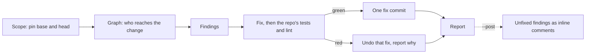

# thurview-fix

Review a change, fix what you are sure of, report the rest. The diff shows what
changed; thurview's code graph shows what depends on it, which is where a
change breaks code the diff never shows.



Run the CLI as `thurview`, or `npx -y thurview` when it is not on PATH. It
prints TOON, and exit code 2 is a usage error. If it answers `unknown flag` for
something below, run `thurview update` and retry once.

## Request

$ARGUMENTS

## Never

- Never push, force-push or post unless this request asks for it. `--post`
  asks to post comments; pushing the fix commit needs its own ask.
- Never rewrite the branch's history. Fixes are a new commit on top.
- Never report style. A finding is a bug, a regression for a caller, a missing
  or broken test, or a security issue.

## 1. Scope

Start from a clean tree (`git status --porcelain` prints nothing), otherwise
ask: the fixes get committed. Check out the head, then pin both commits with
one graph call:

| Request            | Check out                                      | Pin with                                                                          |
| ------------------ | ---------------------------------------------- | --------------------------------------------------------------------------------- |
| empty              | the current branch                             | `thurview graph impact --head HEAD`                                               |
| a branch           | `git switch <branch>`                          | `thurview graph impact --head HEAD`                                               |
| `<base>..<head>`   | the branch at `<head>`                         | `thurview graph impact --base <base> --head HEAD`                                 |
| a PR or MR ref/URL | `gh pr checkout <n>` or `glab mr checkout <n>` | `thurview graph impact --base $(git merge-base origin/<target> HEAD) --head HEAD` |

With `--head` alone the base is where head forked from trunk. For a change
request, `thurview forge status --change <ref>` names `<target>` as
`change.baseBranch`.

The output's `base` and `head` are the pins. Pass `--base <base> --head <head>`
to every later graph command, as its `help` lines do, so your fix commit does
not move what you are reviewing.

## 2. Ask the graph

```sh
thurview graph impact     --base <base> --head <head>  # changed symbols, who reaches them, tests
thurview graph interfaces --base <base> --head <head>  # exports and signatures that moved
thurview graph callers <name> --base <base> --head <head>  # every call site; --graph base for before
thurview graph tests-for <name> --base <base> --head <head>
```

What to take from them:

- **`impact.reach`** lists code that calls a changed symbol and was not changed
  itself - what the author may have forgotten. `at` is the line of the call,
  `via` the changed symbol it reaches. Read each call site against the new
  behaviour: this is the finding a diff cannot give you.
- **`reach[].tested: false`**: no test reaches that caller, so nothing catches
  a break there.
- **`interfaces`** rows `changed` or `removed`: run `callers` on each, with
  `--graph base` for a removed one, since head no longer has its callers.
- **`impact.untested`**: changed symbols no test reaches.
- **`unresolved`, `truncated`**: references the graph could not resolve and
  files past its cap. "No callers" is only as true as those allow; say so when
  a finding rests on it.

Then read the diff (`git diff <base> <head>`) and every call site the rows name.

## 3. Findings

For each one, record:

- `file:line` at `<head>`, now, before a fix moves lines
- severity: `high` (wrong behaviour on a normal path, data loss, security),
  `medium` (a likely bug, or a risky path no test reaches), `low` (real but
  narrow)
- why, in one line
- the graph evidence when there is some, e.g.
  `reach: checkout src/cart.js:5 via discount, tested false`

Security means input crossing a trust boundary: a shell command, query or path
built from it, a secret reaching a log, an authorization check the change
skips.

A problem that is just as present at `<base>` is not this change's finding.
Leave it unfixed and list it after the report's table.

## 4. Fix

Find the repository's own test and lint commands - `CONTRIBUTING.md`,
`AGENTS.md`, the package manifest's scripts, a `Makefile`, the CI config - and
run them once before editing. What is already red at head is not yours: note
it, and judge each fix by not making it worse.

For each finding whose fix is local and whose right behaviour is unambiguous:

1. For a bug, first add or extend a test and run it: it must fail, for the
   reason the finding gives.
2. Edit, then run the tests and lint.
3. Green: keep it. Red: undo only that fix (`git restore <files>`, and delete
   files it created) and mark the finding unfixed, with the failure as why.

Leave a finding unfixed when it needs a decision the code cannot make, changes
an interface used outside this repository, or no test can show it.

Once every kept fix passes together, commit them as one. Follow the
repository's commit convention when it has one; otherwise:

```sh
git add <files>
git commit -m "fix: address review findings" -m "<one line per fix: file:line - why>"
```

## 5. Report

One table - severity, `file:line`, the finding, its graph evidence, and the fix
commit or why it is unfixed - then the tests and lint after the commit, and
what the graph could not see. Do not push; offer to.

## 6. Post, with `--post` only

Only on a change request, only the unfixed findings, and before the fix commit
is pushed, so the lines still match the forge's head. Write `pass.json`:

```json
{
  "verdict": "comment",
  "body": "<what was fixed locally, what is left and why>",
  "comments": [{ "path": "src/cart.js", "line": 5, "body": "<the problem, then a suggestion>" }]
}
```

A comment must sit on a line the change request's diff touches, or the forge
refuses it; a finding on an untouched caller goes in `body`, with a link in the
`permalink` shape `forge status` prints. Keep each comment to a few lines, and
follow the user's own rules for text posted in their name when they keep any.
Check, then post:

```sh
thurview forge submit --change <ref> --file pass.json --dry-run
thurview forge submit --change <ref> --file pass.json
```

The verdict stays `comment`: approving is the maintainer's call. How GitHub and
GitLab differ is in [Forges](references/forges.md).
