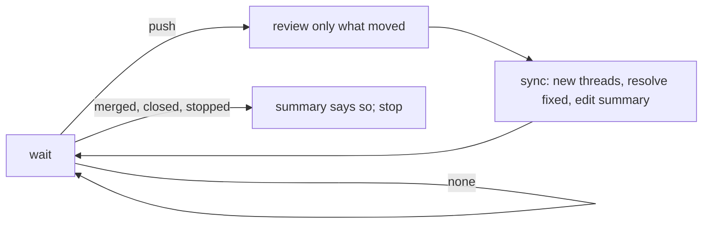

# thurview-pr-review

Review a change request where its author already is, and keep the review true
until the change request is merged or closed. The forge holds all the state:
one summary note with a hidden marker, one thread per finding with a hidden
marker. Nothing is kept on this machine, so the loop can die and resume
anywhere.



Run the CLI as `thurview`, or `npx -y thurview` when it is not on PATH. It
prints TOON, and exit code 2 is a usage error. If it answers `unknown flag` or
`unknown command` for something below, run `thurview update` and retry once.

## Request

$ARGUMENTS

`--once` posts one pass and stops there. `--stop` runs
`thurview pr-review stop --change <ref>` and nothing else.

## Never

- Never approve, merge, close or push to the change request. The verdict is
  the summary's confidence. The command has no verb for any of those, and you
  do not reach around it with `gh` or `glab`.
- Never post a second summary. `sync` edits the one it finds.
- Never post a finding you are not sure of. Leave it out and say in a risk
  bullet that something was not confirmed.
- Never post what you would not sign. Follow the user's own rules for text
  posted in their name when they keep any - a sign-off line goes in `signoff`.

## 1. Where the review stands

```sh
thurview pr-review status --change <ref>
```

It prints the change request's head and base, the head the last pass reviewed
(`review.reviewedHead`), every open finding with its `id`, and the categories
and confidence scale below. A stopped review stays stopped: do not sync it.

## 2. Review only what moved

- No summary yet: review `git diff <base> <head>`, the whole change.
- A summary at an older head: review `git diff <reviewedHead> <head>`. When
  `git merge-base --is-ancestor <reviewedHead> <head>` fails, the branch was
  rewritten: review the whole change again.

Fetch the head first (`gh pr checkout <n>` or `glab mr checkout <n>`, or
`git fetch origin <fetchRef>`), and search at the pinned commits with the
recipes in the `thurview` skill's Searching the code reference
(`thurview skill` prints its path). The evidence rules are `thurview-fix`'s:
a problem just as present at the base is not this change's finding, and a
finding that rests on "no callers" says which search found none.

Then decide each open finding against the new head: **fixed**, or **still
valid** (do nothing - its thread stays open and is not posted again).

## 3. Findings

One point per finding, on a line the diff touches - the forge refuses any
other line. Prefer one real defect over many nits.

| Category          | Definition                                                                     |
| ----------------- | ------------------------------------------------------------------------------ |
| `bug`             | The code does the wrong thing for an input it accepts.                         |
| `security`        | An attacker gains access, data or execution they should not have.              |
| `performance`     | Time, memory or calls grow worse than the change needs.                        |
| `reliability`     | A failure, retry, timeout or race is handled wrongly or not at all.            |
| `compatibility`   | A public API, schema, config, flag or data format breaks its callers.          |
| `maintainability` | The next change here is harder: duplication, dead code, a misleading name.     |
| `tests`           | A behaviour the change adds or alters is not tested, or a test proves nothing. |
| `docs`            | A comment, README or doc now says something the code does not do.              |

Severity is `blocking` (must be fixed before merge), `non-blocking` (worth
fixing) or `nit` (taste, and the comment says `nit:`).

Confidence that the change is safe to merge:

| Score | Meaning                                                     |
| ----- | ----------------------------------------------------------- |
| 5     | Safe to merge; nothing open beyond nits.                    |
| 4     | Safe to merge; non-blocking findings are worth a look.      |
| 3     | Unsure: a risk is named that the review could not rule out. |
| 2     | Not yet: a blocking finding is open.                        |
| 1     | Do not merge: it breaks something that works today.         |

An open blocking finding caps confidence at 2; `sync` refuses more.

## 4. Sync

Write `pass.json` for this head. `findings` holds only what is new; `fixed`
holds the ids of open findings this push fixed:

```json
{
  "confidence": 2,
  "reason": "Safe once the retry loop stops on a 4xx.",
  "risk": ["Every upload goes through the changed retry path.", "No test covers a 4xx."],
  "change": "Retries a failed upload three times with exponential backoff.",
  "reviewUrl": "https://reviews.example.com/pr-7/",
  "signoff": "<the user's sign-off line, when they keep one>",
  "findings": [
    {
      "category": "bug",
      "severity": "blocking",
      "path": "src/upload.ts",
      "line": 42,
      "startLine": 40,
      "title": "The retry loop never stops on a 4xx.",
      "body": "Return the response on any status below 500.",
      "suggestion": "if (res.status < 500) return res;"
    }
  ],
  "fixed": ["3f2a9c1b07"]
}
```

- `reason` is one line; `risk` is one to five bullets naming what could break,
  the blast radius, and anything touching security, data, infra or a public
  API; `change` is two or three sentences.
- The summary is capped at 120 words, the counts table aside. `sync` refuses
  more: cut to what the author acts on.
- A finding's `title` is the claim in one line, `body` the fix. Title, body
  and sign-off together fit five lines. `suggestion` replaces the lines from
  `startLine` to `line` and is optional.
- `reviewUrl` links the full rendered review. When the user has a publish
  target - `thurview export --out <folder>` into a Pages folder or a static
  host they serve - publish there and pass its URL. With none, leave it out.

```sh
thurview pr-review sync --change <ref> --file pass.json --dry-run
thurview pr-review sync --change <ref> --file pass.json
```

The dry run prints the summary as it will read. A finding already open is
reported under `duplicates` and not posted twice.

## 5. Follow

```sh
thurview pr-review wait --change <ref>      # --interval 120 --timeout 540 by default
```

It blocks until there is something to do and prints one `event`:

| Event                         | Do                                           |
| ----------------------------- | -------------------------------------------- |
| `push`                        | back to step 2, with `since` as the old head |
| `none`                        | run `wait` again                             |
| `merged`, `closed`, `stopped` | stop: the summary already says so            |

With `--once`, stop after the first sync.

A reader stops the loop with the `thurview:stop` label or a comment that
starts `/thurview stop`; you stop it with `thurview pr-review stop`. A stopped
review resumes with `thurview pr-review start --change <ref>` once the label
is gone. Report what you posted and the summary's link when the loop ends.

How GitHub and GitLab differ, and what each supports, is in
[Forges](references/forges.md).
