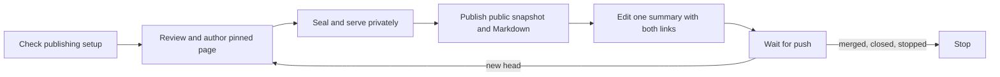

# thurview-pr-review

This is the entrypoint for reviewing an **opened PR or MR**, on GitHub or
GitLab, including a request for its browser walkthrough. Do the whole flow
here; the user does not need to choose a separate authoring or cloud skill.
For a local branch or commit range, use `thurview` instead.

One summary and its finding threads live on the forge. The document, cloud
configuration and retained snapshot archive live in the publishing store.
Resume against that same store: forge markers alone do not recover its
snapshot assets. Never deploy an empty replacement after losing the archive.



Run the CLI as `thurview`, or `npx -y thurview` when it is not on PATH. It
prints TOON, and exit code 2 is a usage error. If it answers `unknown flag` or
`unknown command` for something below, run `thurview update` and retry once.

## Request

$ARGUMENTS

`--once` posts one pass and stops there. `--stop` runs
`thurview pr-review stop --change <ref>` and nothing else.

## Never

- Never approve, merge, close or push to the change request. The verdict is
  the summary's confidence. The command has no verb for any of those, and you
  do not reach around it with `gh` or `glab`.
- Never post a second summary. `sync` edits the one it finds.
- Never post a finding you are not sure of. Leave it out and say in a risk
  bullet that something was not confirmed.
- Never post what you would not sign. Follow the user's own rules for text
  posted in their name when they keep any - a sign-off line goes in `signoff`.

## 0. Publishing preflight, before reviewing

Read the repository's rules, then user guidance in
`$THURVIEW_HOME/THURVIEW.md` (default `~/.thurview/THURVIEW.md`) and
repository guidance in its root `THURVIEW.md`; repository guidance wins
on conflict. Check the
change request's status first (step 1); a stopped, merged or closed review
needs no publishing setup.

```sh
thurview publish-static --check --to cloudflare
```

It checks the saved target, `wrangler whoami --json` and the Worker's
production deployment. It uploads nothing and needs no review id. If it
fails, **stop before reviewing or posting**, name the missing part and give
only the relevant numbered steps from
[Cloudflare setup](references/cloudflare-setup.md). Complete setup once,
write the chosen account, project and public origin to
`$THURVIEW_HOME/cloudflare.json`, and rerun the check. Reuse that file and
Wrangler's login on every later request; ask again only for a failed login,
a changed target or an explicit user change. Never ask for a pasted token.

A PR/MR review request includes publishing its public review page. Explain
that the snapshot contains quoted code and sent feedback, is read only and
has no expiry. Honor any explicit restriction on sharing; for a private
repository, get the user's publication authorization or use their already
authorized protected target before proceeding. Do not turn a saved target
into authorization to expose another private repository.

A summary must have both links on the first pass and every update. Do not
post a partial summary with a missing link or a `pending` placeholder. Keep
the interactive live URL private, and leave `allowLiveLink: false` in the
cloud configuration so the snapshot cannot disclose it either.

## 1. Where the review stands

```sh
thurview pr-review status --change <ref>
```

It prints the change request's head and base, the head the last pass reviewed
(`review.reviewedHead`), every open finding with its `id`, and the categories
and confidence scale below. A stopped review stays stopped: do not sync it.

## 2. Review only what moved

- No summary yet: review `git diff <base> <head>`, the whole change.
- A summary at an older head: review `git diff <reviewedHead> <head>`. When
  `git merge-base --is-ancestor <reviewedHead> <head>` fails, the branch was
  rewritten: review the whole change again.

Fetch the head first (`gh pr checkout <n>` or `glab mr checkout <n>`, or
`git fetch origin <fetchRef>`), and search at the pinned commits with the
recipes in [Searching the code](../thurview/references/searching.md). The evidence rules are `thurview-fix`'s:
a problem just as present at the base is not this change's finding, and a
finding that rests on "no callers" says which search found none.

Then decide each open finding against the new head: **fixed**, or **still
valid** (do nothing - its thread stays open and is not posted again).

## 3. Findings

One point per finding, on a line the diff touches - the forge refuses any
other line. Prefer one real defect over many nits.

| Category          | Definition                                                                     |
| ----------------- | ------------------------------------------------------------------------------ |
| `bug`             | The code does the wrong thing for an input it accepts.                         |
| `security`        | An attacker gains access, data or execution they should not have.              |
| `performance`     | Time, memory or calls grow worse than the change needs.                        |
| `reliability`     | A failure, retry, timeout or race is handled wrongly or not at all.            |
| `compatibility`   | A public API, schema, config, flag or data format breaks its callers.          |
| `maintainability` | The next change here is harder: duplication, dead code, a misleading name.     |
| `tests`           | A behaviour the change adds or alters is not tested, or a test proves nothing. |
| `docs`            | A comment, README or doc now says something the code does not do.              |

Severity is `blocking` (must be fixed before merge), `non-blocking` (worth
fixing) or `nit` (taste, and the comment says `nit:`).

Confidence that the change is safe to merge:

| Score | Meaning                                                       |
| ----- | ------------------------------------------------------------- |
| 5     | Safe to merge; nothing open beyond nits.                      |
| 4     | Not yet: non-blocking findings are worth a look before merge. |
| 3     | Unsure: a risk is named that the review could not rule out.   |
| 2     | Not yet: a blocking finding is open.                          |
| 1     | Do not merge: it breaks something that works today.           |

An open blocking finding caps confidence at 2; `sync` refuses more. Only a 5
opens the summary with `Next: merge`; a 4 sends the author to the open
non-blocking findings, or to the risk when none is open.

## 4. Author, serve and publish this head

Use the same source worktree and publishing store throughout:

```sh
thurview scaffold --pr <ref>
```

Record `review.id`, `review.dir`, `review.base`, `review.head` and the authored
file paths. Reusing the PR/MR binding re-pins the existing document. Check
that the pinned head equals the full head you just reviewed. On later pushes,
use `thurview scaffold --update --review <id>`; review the incremental diff
but rewrite the page to describe the whole current change, rechecking every
anchor that moved.

Read the shared authoring contracts directly, without loading another
workflow: [Document authoring](../thurview/references/document-authoring.md),
[Components](../thurview/references/components.md),
[Software map](../thurview/references/software-map.md) and
[Searching the code](../thurview/references/searching.md).
Write `review.md`, `data.yaml` and `map.yaml` in `review.dir`. Anchor claims at
the pins, include the findings and tests actually checked, answer `security`
and declare the interface changes. Add a map when it explains boundaries;
otherwise leave `nodes: []` and say why.

```sh
thurview publish --review <id>
thurview open --review <id>
thurview publish-static <id> --to cloudflare
```

Fix all publish errors before proceeding. `open` starts the live server;
give its URL only to the operator. The snapshot command returns
`snapshot.url`, updates the same random path and retains earlier documents'
assets. Initialize its archive only on the first use of a dedicated Worker
with no snapshots (see setup); otherwise restore a lost archive.

Set `reviewUrl` to the returned snapshot URL and `markdownUrl` to
`feedback.md` resolved relative to that URL. Fetch both links and require
HTTP 200 before syncing. Check the snapshot's sealed revision/head against
this pass; never reuse an older URL record as proof of a current deploy. If
deployment or either fetch fails, stop and report it to the operator; leave
the previous summary intact. If the forge head moved, re-pin, review the new
push and publish again before syncing.

## 5. Sync

Write `pass.json` for this head. `findings` holds only what is new; `fixed`
holds the ids of open findings this push fixed:

```json
{
  "head": "<the full sha you reviewed>",
  "confidence": 2,
  "reason": "Safe once the retry loop stops on a 4xx.",
  "risk": ["Every upload goes through the changed retry path.", "No test covers a 4xx."],
  "change": "Retries a failed upload three times with exponential backoff.",
  "reviewUrl": "https://reviews.example.com/pr-7/",
  "markdownUrl": "https://reviews.example.com/pr-7/feedback.md",
  "signoff": "<the user's sign-off line, when they keep one>",
  "findings": [
    {
      "category": "bug",
      "severity": "blocking",
      "path": "src/upload.ts",
      "line": 42,
      "startLine": 40,
      "title": "The retry loop never stops on a 4xx.",
      "body": "Return the response on any status below 500.",
      "suggestion": "if (res.status < 500) return res;"
    }
  ],
  "fixed": ["3f2a9c1b07"]
}
```

- `head` is the commit you reviewed. `sync` refuses the pass when the change
  request moved on since: review what the new push added, then sync again.
- `reason`, `change`, `signoff` and each `risk` bullet are one line each;
  `sync` refuses a line break in any of them. `reason` is one sentence;
  `risk` is one to five bullets naming what could break, the blast radius, and
  anything touching security, data, infra or a public API; `change` is two or
  three sentences.
- The compact summary opens with the next action and confidence on one line,
  followed by the public review and Markdown links. Its two-column findings
  table lists severity, category and title beside a `file:line` thread link,
  blocking first. With zero findings it says `No open findings.` and omits
  the table. Full finding detail stays in the inline thread and review page.
- A first pass says `First review`. An edited pass folds `Since this review`
  with resolved, new and still-open counts from that pass. The CLI returns
  them as `sinceLastReview` (`resolved`, `new`, `stillOpen`), not lifetime
  totals. Change and risks
  are folded separately; the reviewed head and UTC sync timestamp stay small
  below them. The sign-off is last. Both forges use ordinary Markdown tables
  and HTML `details`/`summary`, with blank lines around their Markdown.
- The 120-word budget applies to authored `reason`, `change`, all `risk`
  bullets and `signoff` together, including folded text. Generated verdicts,
  finding rows, links, update counts, labels and head/time metadata are
  excluded. Finding titles/bodies still have their separate five-line limit.
  `sync` counts the inputs before rendering, so Markdown or HTML cannot hide
  words from the budget, and rejects excess prose before writing anything.
  Cut to what the author acts on.
- A finding's `title` is the claim in one line, `body` the fix. Title, body
  and sign-off together fit five lines. `suggestion` replaces the lines from
  `startLine` to `line` and is optional.
- `reviewUrl` and `markdownUrl` are required by this workflow on **every**
  pass, even when there are no findings. Use only the public snapshot and
  its Markdown download from step 4. Never use the live URL on a public
  repository. The CLI keeps the fields optional for other callers; that
  compatibility does not make the links optional here.

```sh
thurview pr-review sync --change <ref> --file pass.json --dry-run
thurview pr-review sync --change <ref> --file pass.json
```

The dry run prints the summary as it will read. A finding already open is
reported under `duplicates` and not posted twice.

## 6. Follow

```sh
thurview pr-review wait --change <ref> --interval 15 --timeout 60
```

It blocks until there is something to do and prints one `event`:

| Event                         | Do                                            |
| ----------------------------- | --------------------------------------------- |
| `push`                        | steps 0–5 again, with `since` as the old head |
| `none`                        | check live feedback, then wait again          |
| `merged`, `closed`, `stopped` | stop: the summary already says so             |

Between forge waits, run `thurview wait --review <id> --timeout 60` to receive
live questions and decisions. Answer the returned threads using the lifecycle
reference, resolve only what you addressed, then seal and refresh the snapshot
and summary if its content changed. A browser approval is not a forge approval
and does not authorize modifying or merging the source branch. Return to the
forge wait afterward; the PR/MR's merge, close or stop ends this workflow.
Only the document wait advertises an agent listening on the live page; do not
claim continuous live listening while the forge wait runs.

With `--once`, stop after the first complete publish and sync. Follow the
[Lifecycle](../thurview/references/lifecycle.md) for private page feedback.
Do not change the source branch as part of this review.

A reader stops the loop with the `thurview:stop` label or a comment that
starts `/thurview stop`; you stop it with `thurview pr-review stop`. A stopped
review resumes with `thurview pr-review start --change <ref>` once the label
is gone. Report what you posted, the summary comment URL, the public page and the
Markdown link when the loop ends. Say whether the live page has an agent
listening; questions asked without one are queued.

How GitHub and GitLab differ, and what each supports, is in
[Forges](references/forges.md).
