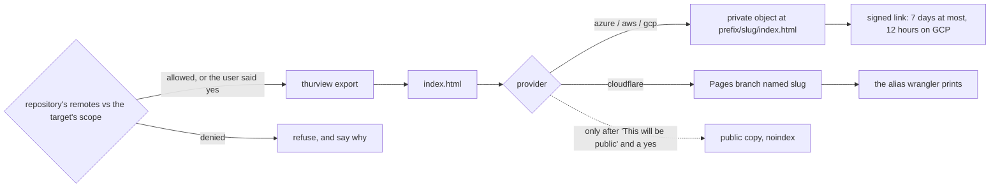

# thurview publish

For an opened PR/MR review, use `thurview-pr-review` as the single entrypoint.
It owns the durable Workers snapshot and Markdown links in the managed
summary, with configuration in `cloudflare.json`. This skill is for separately
requested cloud copies of reviews, explainers and designs; its multi-provider
`publish.yaml` targets are a different contract. Do not copy one configuration
into the other or send a PR review through both workflows.

Put a thurview document where someone without thurview can open it, in the
user's own cloud, and give them a link that stops working on its own.



Four rules hold on every provider:

- **The user's own target, and only for code it is meant for.** A target
  belongs to its user, and some are personal only - never for work or
  company code. Before exporting anything, run the
  [scope check](#0-check-the-target-may-take-this-repository): refuse on a
  deny match, or on no allow match when the target has an allow list, and
  say which remote and pattern decided it. With no scope configured, ask the
  user whether this target is right for this repository, and wait for a yes.
- **The user's own login, never a secret.** Every command below runs as the
  identity the user's CLI is already [signed in](#signing-in) as. Never ask
  for, store, paste or pass an account key, connection string, secret access
  key, service-account key file or API token, and never set one in the
  environment yourself. If the CLI is not signed in, stop and tell the user
  which login command to run - do not work around it.
- **Ask before the first upload.** Name the target, its provider, the bucket
  or container, the object path, the expiry and whether the reader's threads
  go in, and wait for a yes. An update of a copy the user already published
  needs no second yes unless the target or the visibility changes.
- **Private, with a link that expires, by default.** The object stays private
  and the link you hand back is signed for `expiry_days` (default 7), clamped
  to the cloud's own limit: 7 days on Azure and AWS, 12 hours on GCP. A
  public copy is opt-in only: see
  [Public copies](#public-copies-only-on-confirmation).

## Signing in

Interactive login is the default: it is how a person publishes from their
own machine, and the CLI keeps the session in its own user config, not in
anything thurview or the repository holds. Environment credentials are only
for a non-interactive run - CI, a scheduled job - where whoever owns that
environment sets them; the skill never does.

| Provider   | Interactive, the default                                     | Non-interactive only                                                                                                             |
| ---------- | ------------------------------------------------------------ | -------------------------------------------------------------------------------------------------------------------------------- |
| Azure      | `az login`                                                   | `az login --identity` (a managed identity), or a federated service principal the pipeline signs in                               |
| AWS        | `aws sso login --profile <profile>`                          | the role the environment provides: an instance or task role, or web identity (`AWS_ROLE_ARN` with `AWS_WEB_IDENTITY_TOKEN_FILE`) |
| GCP        | `gcloud auth login`                                          | the attached service account, or workload identity federation (`gcloud auth login --cred-file=<config>`, no key)                 |
| Cloudflare | `wrangler login` (OAuth, kept in wrangler's own user config) | `CLOUDFLARE_API_TOKEN` and `CLOUDFLARE_ACCOUNT_ID`, set in that environment by its owner                                         |

## The config

The settings live in `${THURVIEW_HOME:-$HOME/.thurview}/publish.yaml`, the
user's own file beside thurview's review store - never in a repository, and
never in the exported page. Read it before anything else. When it is missing,
ask the user for their target and its scope, write it, and show it to them.

A user can have several targets - a personal one, a work one - each with its
own provider and its own scope. This one keeps a personal Cloudflare project
for the user's own repositories, never a company's, and a work Azure account
for the company's code only. A deny always wins over an allow:

```yaml
default: personal # the target used when the user names none
prefix: thurview # every copy goes under <prefix>/<slug>/index.html
expiry_days: 7 # whole days, 1 or more; clamped to 7 on Azure and AWS, 12 hours on GCP
targets:
  personal:
    provider: cloudflare
    project: my-reviews
    allow_remotes: # only my own repositories...
      - github.com/example-user/**
    deny_remotes: # ...and never the company's code, even under a name I own
      - gitlab.example.com/**
      - github.com/example-corp/**
  work:
    provider: azure
    account: examplecorpreviews
    container: reviews # a private container, not $web
    allow_remotes: # this account takes the company's code and nothing else
      - gitlab.example.com/**
  aws:
    provider: aws
    bucket: my-review-bucket
    profile: default # the AWS CLI profile or SSO session to use
    region: eu-west-1
  gcp:
    provider: gcp
    bucket: my-review-bucket
    signer: thurview-signer@my-project.iam.gserviceaccount.com # impersonated to sign, never a key file
published: {} # <review id>: { target, slug, public, url, expires }
```

A target names its `provider` and that provider's fields: `account` and
`container` for Azure, `bucket`, `profile` and `region` for AWS, `bucket` and
`signer` for GCP, `project` for Cloudflare. `allow_remotes` and
`deny_remotes` are globs over a remote's host and path, such as
`gitlab.example.com/team/**`: `*` stays inside one path segment, `**`
crosses them, and case does not matter. `published` is how a document keeps
one path: it maps each review id to the target and slug its copy lives
under. Write it after every upload, re-sign and unpublish, and update or
unpublish a copy only on the target it records.

Every block from step 1 on reads the config through these shell variables.
Run each operation - publish (steps 1 to 4), re-sign, unpublish - as **one** script
file run with `bash`, never typed into an interactive shell, that starts by
setting them, so no block runs in a shell where they are empty, and stops at
the first command that fails:

```sh
set -euo pipefail
REVIEW="<review id>"
PROVIDER="<target.provider>" PREFIX="<prefix>" EXPIRY_DAYS="<expiry_days>"
SLUG="<published.<review id>.slug, or empty for a first upload>"
ACCOUNT="<target.account>" CONTAINER="<target.container>"
BUCKET="<target.bucket>" PROFILE="<target.profile>" REGION="<target.region>"
SIGNER="<target.signer>" PROJECT="<target.project>"
```

For a public Azure copy, `CONTAINER` is `'$web'` instead - see
[Public copies](#public-copies-only-on-confirmation).

## Workflow

### 0. Check the target may take this repository

Before exporting or uploading anything - and again before every update,
since a repository's remotes can change - hold the review's repository to
the target's scope. Run it **on its own, before the publish script**, not
inside it, so its answer decides whether that script runs at all. The
repository is the review's worktree: `thurview info --all --fields worktree`
lists it beside the review's id. The script sits in this skill's own
directory; pass one `--deny` per `deny_remotes` entry and one `--allow` per
`allow_remotes` entry of the chosen target:

```sh
node "<this skill's directory>/scripts/check-scope.mjs" --repo "<the review's worktree>" \
  --deny '<a deny_remotes entry>' --allow '<an allow_remotes entry>'
```

It checks every fetch and push URL of every remote, reduced to host and
path, and an ssh alias also by the host `ssh -G` says it names. It prints one
line per URL saying what decided it. Its exit code decides what happens
next:

| Exit | Meaning                                                                           | Do                                                                                                                                                                                     |
| ---- | --------------------------------------------------------------------------------- | -------------------------------------------------------------------------------------------------------------------------------------------------------------------------------------- |
| 0    | allowed: no remote denied, and every one allowed when a list is set               | run the publish script                                                                                                                                                                 |
| 1    | refused: a remote is denied, or matches no allow pattern                          | stop. Tell the user the remote and the pattern it printed, and that this target is not for this repository. Do not offer a way round it; the user changes the config if it is wrong    |
| 2    | nothing to decide by: no scope set, no remote, no repository, a local-path remote | ask the user whether this target is right for this repository, naming its remotes; run the publish script only on a yes, and suggest adding a scope so the question does not come back |

A deny list only refuses the hosts and paths it names. For a personal target,
an `allow_remotes` list of the user's own namespaces is the stronger guard:
work code under a name nobody thought to deny is refused too.

### 1. Export the page

```sh
OUT="$(mktemp -d)"
trap 'rm -rf "$OUT"' EXIT
thurview export --review "$REVIEW" --out "$OUT" --no-threads
FILE="$OUT/index.html"
```

The page is the one the `thurview` skill's _Sharing a copy that needs no
server_ section describes: read only, self-contained, fetching nothing,
naming no server and no local path, and marked `noindex, nofollow`.
`--no-threads` keeps the reader's threads and decisions out, because a link
travels further than the conversation it was sent in. Drop it only when the
user asked for the threads in the copy. The trap deletes `$OUT` when the
script ends, whether the upload worked or not.

### 2. Find or mint the slug

`SLUG` is the one `published` recorded for this review, so the upload
overwrites the same object and the link the user already sent keeps pointing
at the current copy. A first upload mints one:

```sh
SLUG="${SLUG:-r$(node -e 'console.log(require("node:crypto").randomBytes(12).toString("hex"))')}"
OBJECT="${PREFIX:?set PREFIX from publish.yaml}/$SLUG/index.html"
```

`r` and 24 random hex characters: 96 bits, so a path cannot be guessed from
the review id, the title or another link, and short, lowercase and
alphanumeric, so Cloudflare Pages takes it unchanged as a branch alias.
Never derive the slug from the review id, a branch or the title. The prefix
is required: the grants below cover `<prefix>/*` and nothing else.

### 3. Work out the expiry

```sh
case "${EXPIRY_DAYS:-7}" in
  "" | 0* | *[!0-9]*) echo "expiry_days must be a whole number of days, 1 or more" >&2 && exit 2 ;;
esac
MAX_SECONDS=604800
if [ "$PROVIDER" = gcp ]; then MAX_SECONDS=43200; fi
EXPIRY_SECONDS=$((${EXPIRY_DAYS:-7} * 86400))
if [ "$EXPIRY_SECONDS" -gt "$MAX_SECONDS" ]; then EXPIRY_SECONDS=$MAX_SECONDS; fi
EXPIRY_AT="$(node -e 'console.log(new Date(Date.now() + process.argv[1] * 1000).toISOString().slice(0, 16) + "Z")' "$EXPIRY_SECONDS")"
```

| Provider | Longest link                 | Why                                                                     |
| -------- | ---------------------------- | ----------------------------------------------------------------------- |
| Azure    | 7 days                       | a user-delegation key, which signs the SAS, lives 7 days at most        |
| AWS      | 7 days, or the session's end | SigV4 presigning stops at 604800 s, and at the signing credential's end |
| GCP      | 12 hours                     | a URL signed by impersonating a service account lives 12 hours at most  |

When the user asked for more, say it was clamped and to what. On GCP that is
every request over half a day: say so before the first upload, and point at
[re-signing](#re-signing-a-link) for a fresh link.

### 4. Upload and sign, per provider

Run only the provider's own section, then go to step 5.

#### Azure Storage

```sh
az storage blob upload --auth-mode login --account-name "$ACCOUNT" \
  --container-name "$CONTAINER" --name "$OBJECT" --file "$FILE" --overwrite \
  --content-type "text/html; charset=utf-8" --content-cache-control "no-cache"
```

Then sign it - for a private copy only; a public one's link is the static
website's, and a SAS on it would be recorded as an expiring link that is not
the one the reader should get:

```sh
az storage blob generate-sas --auth-mode login --as-user \
  --account-name "$ACCOUNT" --container-name "$CONTAINER" --name "$OBJECT" \
  --permissions r --https-only --expiry "$EXPIRY_AT" --full-uri --output tsv
```

It prints the full link. `--as-user` makes it a
user-delegation SAS, signed by a key Entra ID issues to the user rather than
by the account key, so it is revocable and names who signed it. It also ends
when the delegation key does, which is at most 7 days.

#### AWS S3

```sh
aws s3 cp "$FILE" "s3://$BUCKET/$OBJECT" --profile "$PROFILE" --region "$REGION" \
  --content-type "text/html; charset=utf-8" --cache-control "no-cache"
aws s3 presign "s3://$BUCKET/$OBJECT" --profile "$PROFILE" --region "$REGION" \
  --expires-in "$EXPIRY_SECONDS"
```

Presigning is local: the link is signed with the profile's credentials and
works only while they do. With SSO or an assumed role those are temporary, so
the link dies with the session, often within hours, and nothing here can read
when that is without printing the credentials. So for such a profile, record
`expires` as "when the session ends, at the latest `EXPIRY_AT`", and tell the
user exactly that; a 7-day link needs a long-lived identity the user chooses
to use for it. Keep the bucket's Block Public Access on.

#### Google Cloud Storage

```sh
gcloud storage cp "$FILE" "gs://$BUCKET/$OBJECT" \
  --content-type="text/html; charset=utf-8" --cache-control="no-cache"
```

Then sign it, for a private copy only:

```sh
gcloud storage sign-url "gs://$BUCKET/$OBJECT" --duration="${EXPIRY_SECONDS}s" \
  --impersonate-service-account="$SIGNER"
```

A user's own Google login cannot sign a URL; only a service account can. So
the link is signed by impersonating the `signer` service account through the
user's login, which needs no key file. Never fall back to
`--private-key-file` or an activated service-account key to get a longer
link: a key file is exactly the stored secret this skill does not use. That
is what caps a GCS link at 12 hours.

#### Cloudflare Pages, public unless behind Access

Pages serves every deployment publicly unless the project's preview
deployments sit behind Cloudflare Access, and it has no signed or expiring
link. So confirm with the user first, as for any
[public copy](#public-copies-only-on-confirmation), unless they have told you
the project's previews are behind Access.

wrangler is Cloudflare's own client for Pages' multi-step direct upload, run
through `npx` at a pinned version (4.147.0, the latest stable on npm when
this was written; check `npm view wrangler version` and use that). Run it
from `$OUT`, outside the user's repository, so it does not pick up a
`wrangler.toml` there, and come back before deleting `$OUT`.

```sh
export WRANGLER_SEND_METRICS=false
cd "${OUT:?}"
printf '/*\n  X-Robots-Tag: noindex, nofollow\n  Referrer-Policy: no-referrer\n  Cache-Control: no-cache\n' >_headers
if ! npx --yes wrangler@4.147.0 pages project list --json |
  node -e 'let s = ""; process.stdin.on("data", (d) => (s += d)).on("end", () => process.exit(JSON.parse(s).some((p) => p["Project Name"] === process.argv[1]) ? 0 : 1))' "$PROJECT"; then
  npx --yes wrangler@4.147.0 pages project create "$PROJECT" --production-branch production
fi
npx --yes wrangler@4.147.0 pages deploy "$OUT" --project-name "$PROJECT" --branch "${SLUG:?}" --commit-dirty=true
cd - >/dev/null
```

- **The project must exist before `pages deploy`.** Run without a terminal,
  a deploy to a missing project fails, and wrangler can turn `pages deploy`
  into a Workers deploy when it detects an agent and the project is missing.
  So the block creates `$PROJECT` only when the list lacks it - name that in
  the question before the first upload, so the yes covers a new project too.
  Its production branch is one
  nothing is ever deployed to, so the bare project domain stays empty.
- **One preview branch per document.** The branch is the slug, and a
  redeploy to the same branch updates its alias in place. Hand over the
  **Deployment alias URL** wrangler prints, not the per-deployment
  `<hash>.` one, and never build it from the project name: when the name was
  taken, Pages gave the project a suffixed subdomain, which the list's
  `Project Domains` shows. `*.pages.dev` uses a wildcard certificate, so an
  alias never shows up in Certificate Transparency logs.
- Pages already sends `X-Robots-Tag: noindex` on preview deployments; the
  `_headers` file adds `nofollow`, `no-referrer` and `no-cache`, and keeps
  them should a deployment ever be promoted.
- There is no expiry to set, so `expires` stays empty.

### 5. Record it and hand it over

Write `published.<review id>` with the provider, slug, `public`, the link and
its expiry, then give the user the link and say when it stops working. Do
not print the link anywhere else: it is a bearer credential until it
expires.

## Re-signing a link

A link expired, or the user wants a fresh one. Nothing is uploaded: set the
variables, compute `OBJECT` (step 2, with the recorded slug) and the expiry
(step 3), and run only the signing command of the provider's section in
step 4. Then record the new link and expiry. A link already sent keeps
working until its own expiry; Azure can cut it short by revoking the user's
delegation keys (`az storage account revoke-delegation-keys`), which kills
every user-delegation SAS on the account.

Cloudflare Pages links and public copies do not expire, so there is nothing
to re-sign.

## Unpublishing

Set the variables with the recorded slug, compute `OBJECT` (step 2), run the
provider's own lines, and remove the `published` entry only when they
succeeded: a copy whose record is gone can no longer be found to take down. For a public Azure
copy `CONTAINER` is `'$web'`, as it was when it was uploaded.

```sh
az storage blob delete --auth-mode login --account-name "$ACCOUNT" \
  --container-name "$CONTAINER" --name "$OBJECT"
aws s3 rm "s3://$BUCKET/$OBJECT" --profile "$PROFILE" --region "$REGION"
gcloud storage rm "gs://$BUCKET/$OBJECT"
DEPLOYMENTS="$(npx --yes wrangler@4.147.0 pages deployment list --project-name "$PROJECT" --environment preview --json |
  node -e 'let s = ""; process.stdin.on("data", (d) => (s += d)).on("end", () => { for (const d of JSON.parse(s)) if (d.Branch === process.argv[1]) console.log(d.Id); })' "${SLUG:?}")"
if [ -z "$DEPLOYMENTS" ]; then echo "no deployment of $SLUG listed" >&2 && exit 3; fi
for DEPLOYMENT in $DEPLOYMENTS; do
  npx --yes wrangler@4.147.0 pages deployment delete "$DEPLOYMENT" --project-name "$PROJECT" --force
done
```

A signed link to a deleted object stops working at once. On a versioned S3 or
GCS bucket the delete leaves the older versions behind, readable by anyone
with access to the bucket; say so when the bucket has versioning on. On
Cloudflare, a failing list stops the script before anything is deleted or
forgotten. Exit 3 means the list worked but showed nothing on the slug's
branch - already deleted, or past the first page: open the alias, and remove
the entry only once it no longer answers. `--force` is what removes the
deployment the alias points at, and
without it a run with no terminal deletes nothing and says nothing. The list
returns only the first page of results, so on a busy project an older
deployment of the slug can be missed: tell the user to check the project's
Deployments tab in the dashboard afterwards.

## Public copies, only on confirmation

Only when the user asks for a public copy. Before anything, tell them, in
these words: **"This will be public: anyone with the link can read it, and it
cannot be made to expire."** Name what is in the page (the code it quotes,
and threads if they asked for them), and wait for an explicit yes. Record
`public: true`. The exported page is already `noindex, nofollow`; that keeps
it out of search results, not out of reach.

A copy keeps its visibility. To make a private copy public or the other way
round, [unpublish](#unpublishing) it, clear its slug, and publish afresh, so
no stale copy is left behind at the old path or the old visibility.

- **Azure**: the static website's `$web` container, once the user has
  confirmed. Enabling it changes the whole account and needs **Storage
  Account Contributor**, so it is the user's call. Then run step 4's upload -
  not its SAS - with the container set to `$web`, which needs Storage Blob
  Data Contributor on `$web` as well:

  ```sh
  az storage blob service-properties update --auth-mode login \
    --account-name "$ACCOUNT" --static-website --index-document index.html
  CONTAINER='$web'
  az storage account show --name "$ACCOUNT" --query primaryEndpoints.web --output tsv
  ```

  The link is that endpoint followed by `$OBJECT`. Updates and unpublishing
  use `'$web'` too.

- **AWS**: do not open the bucket. Put CloudFront with Origin Access Control
  in front of it instead, which the user sets up once in their own account;
  then the link is the distribution's domain followed by `/$OBJECT`. Turning
  off Block Public Access with `aws s3api put-public-access-block` exposes
  the whole bucket and is not this skill's to do.

- **GCP**: once the user has confirmed, a bucket with fine-grained access
  can make the one object readable, which needs **Storage Object Admin**
  rather than Object User. A
  bucket with uniform access cannot make one object public, only the whole
  bucket or a managed folder, so refuse and say why. Neither works where
  public access prevention is enforced. Run step 4's upload - not its
  signing - and then the grant, and run the grant again after **every**
  update: an upload writes a new object generation with the bucket's default
  ACL, which drops `allUsers`.

  ```sh
  gcloud storage objects update "gs://$BUCKET/$OBJECT" \
    --add-acl-grant=entity=allUsers,role=READER
  ```

  The link is `https://storage.googleapis.com/$BUCKET/$OBJECT`.

- **Cloudflare**: the deployment in step 4 is already public.

## Setting up, once per provider

The smallest grant that runs this skill, which the user applies in their own
account. A public copy needs more, named in its section above.

| Provider   | Grant to the user                                                                                                                                                                                                                   |
| ---------- | ----------------------------------------------------------------------------------------------------------------------------------------------------------------------------------------------------------------------------------- |
| Azure      | **Storage Blob Data Contributor** on the container; **Storage Blob Delegator** on the storage account, since the user-delegation key is issued at account scope                                                                     |
| AWS        | `s3:PutObject`, `s3:GetObject`, `s3:DeleteObject` on `arn:aws:s3:::<bucket>/<prefix>/*`, and nothing on the bucket itself                                                                                                           |
| GCP        | **Storage Object User** (`roles/storage.objectUser`) on the bucket; **Service Account Token Creator** on the `signer` service account, which itself holds **Storage Object Viewer** on the bucket                                   |
| Cloudflare | `wrangler login` (OAuth, as the user). Or a custom API token with only **Account › Cloudflare Pages › Edit** on the one account, which the user sets as `CLOUDFLARE_API_TOKEN` and `CLOUDFLARE_ACCOUNT_ID` in their own environment |

To keep Cloudflare copies private, the user puts the project's previews
behind Cloudflare Access, once, in the dashboard: Workers & Pages › the
project › Settings › General › **Access policy › Enable**, then **Manage** to
edit the policy to **Include › Emails** or **Emails ending in**. It defaults
to members of the Cloudflare account only. It covers preview deployments,
not the bare project domain or a custom domain, which is one more reason
never to deploy to production. Before relying on it, open an alias in a
private window and see the Access login. Access is free for up to 50 users.

### Smoke test

The user runs this with their own account before publishing a real document:
it uploads a one-line page under a fixed slug, prints a link, and deletes it.
Write it as a script file and run it with `bash`, never pasted into an
interactive shell, where `set -e` and `exit` would close the terminal. The
script is the variables block, then:

```sh
OUT="$(mktemp -d)"
trap 'rm -rf "$OUT"' EXIT
printf '<!doctype html><title>thurview smoke test</title><p>ok\n' >"$OUT/index.html"
FILE="$OUT/index.html"
SLUG=rsmoketest
OBJECT="${PREFIX:?}/$SLUG/index.html"
EXPIRY_DAYS=1
```

then step 3 and the provider's section of step 4. Open the link it prints
and see `ok`. Then run a second script - the variables block with
`SLUG=rsmoketest`, step 2, then the provider's lines from
[Unpublishing](#unpublishing) - and open the link again to see it refused.
Each script's variables die with it, so a real document published afterwards
mints its own slug instead of landing at the guessable `rsmoketest`. On
Cloudflare, use a throwaway project, check `curl -sI` on the alias shows
`x-robots-tag: noindex, nofollow`, and finish with
`npx --yes wrangler@4.147.0 pages project delete <project>`.
