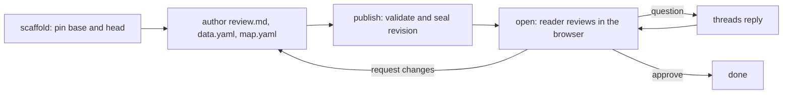

# thurview

The agent studies the change and writes a short document in which every claim
about code is anchored to an exact file and line range at a pinned commit.
thurview validates those anchors, seals a revision, and serves it in the
browser with live code peeks, diffs, diagrams and a map. The reader asks
questions, leaves anchored comments, and approves or requests changes. The
agent answers, updates, republishes.



Run the CLI as `thurview`. When it is not on PATH, `npx -y thurview` runs
the published package with the same commands; substitute it everywhere below.
If a command answers `unknown command` or `unknown flag` for something this
skill tells you to run, the installed CLI is older than the skill: run
`thurview update` and retry once, then report the mismatch if it persists.

Every command prints TOON on stdout: the result, then `help[]` with the next
commands. Errors are structured on stdout too (`error`, `code`, `help`); exit
code 1 is a failure, 2 a usage error such as an unknown flag. Progress goes to
stderr; do not scrape it. `thurview` alone shows the reviews of the current
directory; `thurview <command> --help` shows flags and examples.

## Request

$ARGUMENTS

Empty: the current branch against its up-to-date trunk. A PR number or URL:
that pull request. `--base`/`--head`: that range. Anything else: an
architecture review of that topic in the current repository.

## Before authoring

Read the guidance files that exist, in this order. The second wins on
conflict.

1. `~/.thurview/THURVIEW.md` (or `$THURVIEW_HOME/THURVIEW.md`), user guidance.
2. `THURVIEW.md` at the repository root, repository guidance.

`thurview scaffold` lists the ones it found under `guidance`.

Read [Document authoring](references/document-authoring.md) before you write.
Read [Components](references/components.md) before you edit `data.yaml` or add
a fenced component. Read [Lifecycle](references/lifecycle.md) for statuses,
storage and thread rules. Read [Software map](references/software-map.md)
before you author `map.yaml`. Read [Theme](references/theme.md) before you
write `theme.yaml`.

## Workflow

### 1. Resolve the review

Run `thurview info` in the source worktree. It lists reviews bound to that
worktree with `inSync` (HEAD equals the pinned head). Reuse a review that
matches the requested change. Otherwise run `thurview scaffold` with the
matching flags:

```sh
thurview scaffold                      # current branch vs trunk fork point
thurview scaffold --pr 123             # pull request (needs gh)
thurview scaffold --base <ref> --head <ref>
thurview scaffold --new                # another review for the same binding
thurview scaffold --update --review <id>   # re-pin after the branch moved
```

Record from the scaffold output: `review.id` (short id accepted everywhere),
`review.dir`, `review.base`, `review.head`, `files.document`, `files.data`,
`files.map`, `files.theme`, `change` (files, additions, deletions) and
`guidance`.

Resolve refs before passing them. Pass commit ids or plain ref names; do not
pass `<rev>^` inside a jj workspace.

### 2. Show small changes at once

When `change.additions + change.deletions` is under 300, publish first and
land the reader on the diff, then write the document:

```sh
thurview publish --review <id> --view files --open
```

The scaffolded stub validates as long as `README.md` exists at head; if it
does not, point the `entry` anchor at any file that does. Larger changes skip
this step.

### 3. Study the change

Read the whole diff once (`git diff <base> <head>`). Then read each changed
symbol's callers and callees at head. Trace the main flow through storage,
network and configuration boundaries. Compare the stated intent (commit
messages, PR description, the user's own words) with what the code does. The
gap is the most valuable finding.

Read every range you anchor from the pinned commit, not the working tree:
`git show <head>:<path>` or `git show <base>:<path>`.

### 4. Author the document

Edit `review.md` and `data.yaml` in the review directory following
[Document authoring](references/document-authoring.md). Keep it short.
Default to anchor links for evidence; use an inline peek only when the reader
must see the code to follow the main claim.

### 5. Theme the review after the project

Read [Theme](references/theme.md). Decide the look in its order: what the
user asked for, then the reviewed project's own design system read from its
files at head, then the default skin. Write `theme.yaml` in the review
directory when steps 1 or 2 yield tokens; leave it empty otherwise. Say
which source you used when you hand over the review.

### 6. Author the map

Dispatch one sub-agent to write `map.yaml` per
[Software map](references/software-map.md) while you write the document, with
this prompt filled in:

```text
Use the thurview skill's software-map reference (`thurview skill` prints the
SKILL.md path; the reference is in references/software-map.md beside it).

Review directory: <dir>
Source worktree: <worktree>
Base commit: <base>
Head commit: <head>

Author <dir>/map.yaml: the head structure under nodes/edges and the base
structure under base. Do not edit review.md or data.yaml. Do not publish.
Return when `thurview publish --review <id>` reports no map.yaml errors, or
report the errors you could not fix.
```

Without a sub-agent facility, write the map yourself after the document, or
leave `nodes: []` and say the map is not published.

### 7. Publish

```sh
thurview publish --review <id>
```

Read every row of `diagnostics`. Fix each `error` and publish again. A
`warning` does not block. `publish` refuses (code `THREADS_OPEN`) when a
submitted comment thread is still open (see step 9). On success `published`
carries `rev` and `url`; the status becomes `awaiting-review`.

Then open it for the reader:

```sh
thurview open --review <id>            # prints url; --view files|commits|map
```

Give the user the `url` from the output.

### 8. Wait for the reader

```sh
thurview wait --review <id>
```

It blocks until the reader needs you and prints `wait.reason` with the
threads that need you:

- `question`: an "Ask now" thread. Answer each thread in `threads` with
  `thurview threads reply <threadId> --review <id> --body "<answer>"`. Do
  not change the document for a question. Wait again.
- `awaiting-agent-updates`: the reader submitted with "Request changes".
  `threads` lists what to address and `wait.decision` the summary. Go to
  step 9.
- `accepted`: approved. Report and stop.
- `review-dismissed` or `review-deleted`: stop.
- error `TIMEOUT` (exit code 1, after `--timeout` seconds, default 3600):
  wait again, or report that the reader has not responded.

### 9. Address requested changes

For each thread in `thurview threads list --review <id> --open`:

- A document problem: fix `review.md` or `data.yaml`.
- A code change request: change the branch under the normal rules (failing
  test first), then `thurview scaffold --update --review <id>` to re-pin, and
  re-read every anchored range that moved.
- Answer in the thread with `threads reply` when the reader asked something
  or when it is not obvious what you changed.
- `thurview threads resolve <threadId> --review <id>` once the requested
  change is present. Do not resolve a thread you did not address.

Then publish again (step 7), and wait again (step 8). A republish requires
zero open submitted comment threads; questions do not block.

## Architecture reviews

Pin the same commit as base and head: `thurview scaffold --base HEAD --head
HEAD`. Choose sections that describe the system (data flows, state, storage,
module boundaries) and skip diff-specific ones. Scope to one subsystem. All
other steps are the same; the Files tab shows any file at head on request.

## Completion criteria

Report completion only when all of these hold:

- The reader has the URL of a published revision.
- Every `error` diagnostic is resolved.
- The map is published, or you said why it is not.
- The review is waiting on the reader, accepted, dismissed or deleted.
